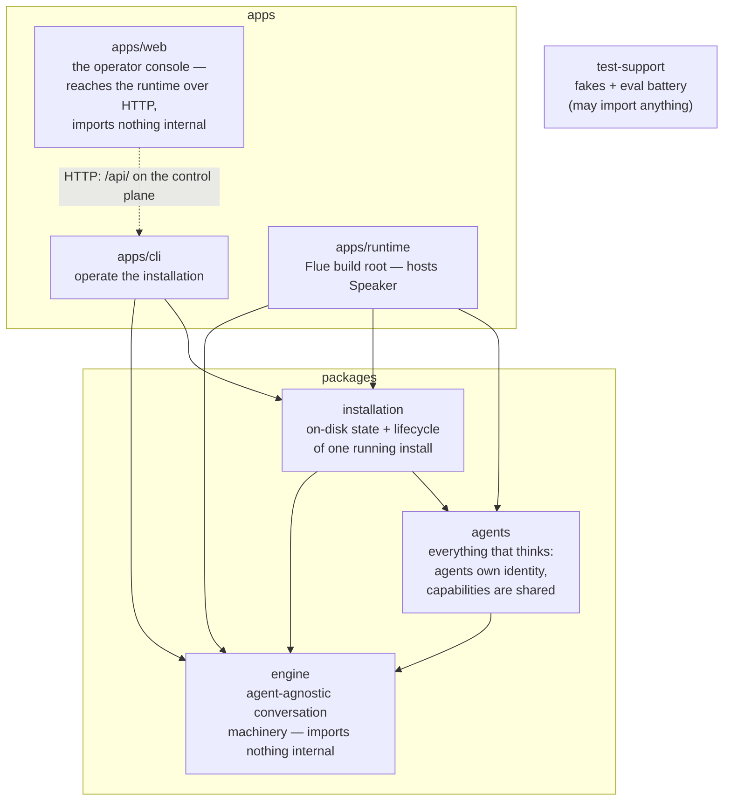
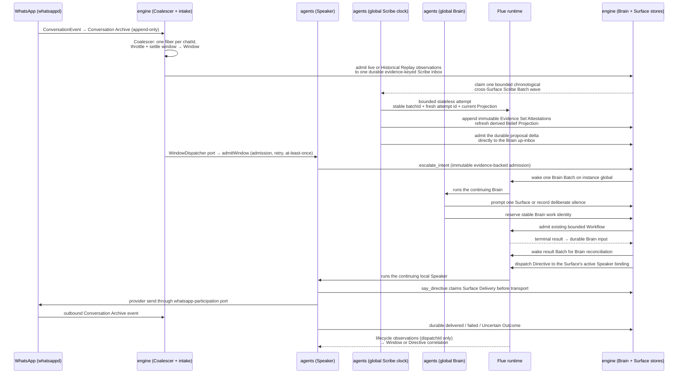

# Architecture map

> This is the **code taxonomy** — which package owns what. For the definitive
> description of how the agentic system _works_ (the Brain, Speakers, the Graph, the
> Digest, the control loop), see [`SYSTEM-ARCHITECTURE.md`](./SYSTEM-ARCHITECTURE.md).
> For the detailed path from Source Archives through knowledge-ready Attention and Work,
> see [`INFORMATION-TO-ACCOUNTABILITY.md`](./INFORMATION-TO-ACCOUNTABILITY.md).

The ratified taxonomy (#117 → #131, extended by #372): three packages, three apps, one arrow
diagram — enforced, not aspirational (`tests/speaker/hard-cut.test.ts`).



**Rules** (verbatim from the hard-cut test): engine → nothing internal; agents → engine;
installation → agents+engine; apps/runtime → all packages; apps/cli → installation+engine
(**never** agents); **apps/web → nothing internal**; test-support → anything. Additionally:
capabilities may never import from an agent folder, and no package may publish a `./*` wildcard
export.

`apps/web` is the strictest row on the list, tied with `engine`. The console is a browser
application: it reaches the runtime only over HTTP, through the control-plane API defined in
`apps/cli/src/control-plane.ts`, so it has no reason to import an internal package and no way to
use one. A future need for a shared type is a reason to re-open that row deliberately, not a
reason to have left it off. Its built assets ship inside the published package (`dist/web`), and
the control plane serves them — the shell unauthenticated, everything under `/api/` gated (#372).

## How information becomes work

The accepted conceptual path is:

```text
Source Archive / Happening
  → deterministic facts and Scribe semantic projection
  → Graph knowledge floor
  → durable Attention Item
  → Brain disposition
  → durable Work Item or direct Effect
  → observable outcome
```

Durable machinery belongs in `engine`; agent identity and judgement policy belong in
`agents`; `apps/runtime` composes provider adapters and the Flue host. The current code has
most of those durable primitives but does not yet connect them in that order. The sequence
below is the **current implementation**, not the accepted target:



The Speaker mounts conversation, Intent escalation, Directive Saying, a work-status pull tool
(`lookup_work`), and read-only Graph tools only. The Brain owns Coder launch, stable work identity,
Flue admission reconciliation, terminal-result admission, the independent choice of reporting
Surface, GitHub events (admitted to the same up-inbox and routed by Brain decision, never
broadcast), and the proactive clock (Scheduled Wake + coalesced Proactive Sweep). The diagram above
is mechanically real, but two arrows are now known architecture gaps: raw GitHub events and
Scribe proposal deltas enter as peer Brain inputs. The accepted target retains each external
Happening, establishes its source-specific knowledge floor, and admits exactly one durable
Attention Item. Brain Batch settlement must then prove a disposition for every claimed
Attention Item. A thin Brain Work Item will sit above existing Effect and Specialist execution
ledgers; those mechanisms are reused, not replaced.

A source-specific readiness policy must also bound semantic projection failure. Exhausting that
finite retry/age budget produces prepared failure evidence and admits the same Happening's
Attention Item; it never leaves the occurrence indefinitely outside the accountability ledger.

## Where things live — quick answers

- **"Any agent needs this"** → `packages/engine`. Precedent: operation-store and input
  contracts moved down in #131.
- **"Durable source, Attention, Batch, Effect, or Work state"** → `packages/engine`.
- **"Source-specific normalization and knowledge-readiness mechanics"** →
  `packages/engine`; model judgement does not belong in the adapter.
- **"A kind of work an agent can do"** → `packages/agents/src/capabilities/<name>/`
  (SKILL.md + tools + port). Shared across agents.
- **"Who an agent is"** → `packages/agents/src/<agent>/` (instructions, composition,
  dispatch). Scribe semantic projection and Brain disposition policy live here.
- **"On-disk state of an install"** → `packages/installation`.
- **Deployables** → `apps/` (cli = operate, server = host). Both are bundled; internal
  packages are compiled in, the server's `package.json` dependency list is the flue-build
  externals manifest.

## Domain vocabulary

`CONTEXT.md` at the repo root is the ratified glossary (Capability, Skill, Window,
Managed Chat, Operation Identity, Uncertain, …). Name things from it; propose additions
there first. For the conceptual system (Brain, Speakers, Graph, Digest, control loop) see
[`SYSTEM-ARCHITECTURE.md`](./SYSTEM-ARCHITECTURE.md).

## Per-package docs

Each workspace has a README: [engine](../packages/engine/README.md) ·
[agents](../packages/agents/README.md) ·
[installation](../packages/installation/README.md) ·
[test-support](../packages/test-support/README.md) ·
[cli](../apps/cli/README.md) · [server](../apps/runtime/README.md)
