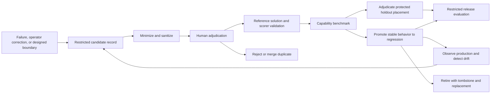

# Evaluation methodology

This document defines how Ambient Agent turns failures and operator corrections into
repeatable evidence, how it evaluates each architecture owner, and how it compares model
profiles without confusing a model score with coworker correctness.

It is methodology, not proof that an evaluation platform exists. The smallest executable
foundation and its dependencies are specified in [Growth path](#growth-path).

## 1. The unit of evaluation

The evaluation unit is the ratified **Evaluation Scenario** from
[`CONTEXT.md` — Agent anatomy](../CONTEXT.md#agent-anatomy): a repeatable Surface situation with controlled provider
state and observable expected effects. This methodology makes that existing domain unit
executable by adding an architecture epoch, named owners, evidence, scorers, and adjudication;
it does not introduce a second evaluation unit.

```text
Evaluation Scenario
  = sanitized evidence and controlled environment
  + architecture epoch
  + named owner(s)
  + expected invariants and observable outcomes
  + scorer and adjudication policy
```

It is not a prompt, expected sentence, historical transcript, test file, Braintrust row, or
Flue run. An Evaluation Scenario may exercise one owner or the accountable path:

```text
Source Archive → Happening → Graph knowledge floor → Attention
  → Brain disposition → Work / Effects → delivery and observable closure
```

The Evaluation Scenario owns its claim. Vitest, vitest-evals, Flue, and Braintrust are
replaceable execution, observation, and analysis mechanisms.

### Vocabulary

| Term                           | Meaning                                                                                                                |
| ------------------------------ | ---------------------------------------------------------------------------------------------------------------------- |
| **Evaluation Scenario**        | The ratified repeatable Surface situation, materialized here as one versioned claim about an owned outcome.            |
| **Architecture epoch**         | The canon commit or decision set for which the scenario is valid. A scenario never silently crosses an epoch.          |
| **Trial**                      | One execution of one scenario under one exact runtime and system-under-test profile.                                   |
| **Evidence bundle**            | Sanitized scenario inputs, durable owner observations, trace ids, outcomes, and scorer results.                        |
| **Scorer**                     | A versioned deterministic check, model judge, or human rubric producing one named dimension.                           |
| **Adjudication**               | Human determination of the scenario's intended outcome and whether its evidence and scorers are valid.                 |
| **Slice**                      | A declared cohort such as source kind, ambiguity, failure mode, owner, language, or consequence risk.                  |
| **Candidate**                  | A sanitized, provenance-bearing scenario proposal that cannot gate a release yet.                                      |
| **Capability scenario**        | A valid scenario used to measure a behavior the system does not yet reliably pass.                                     |
| **Regression scenario**        | A scenario promoted after the behavior is established and suitable for a release gate.                                 |
| **Protected holdout**          | An independently adjudicated restricted dataset partition whose repository manifest is opaque and whose definition is excluded from prompt, policy, scorer, and model tuning. |
| **Retired scenario**           | A preserved tombstone for a scenario that is obsolete, duplicated, saturated, or invalid in the current epoch.         |
| **Benchmark**                  | Paired comparison of configurable profiles on the same pinned scenarios, environment, repetitions, and scoring policy. |
| **System-under-test profile**  | The provider/model/effort assignments whose behavior the benchmark compares.                                           |
| **Evaluation control profile** | Independently pinned judge and scorer identities used to measure each system-under-test profile.                       |

## 2. Evaluation tiers

Evaluation tiers and the repository's five proof tiers are independent axes. For example, a
live WhatsApp receipt can be proof-tier 4 readback but contain no valid behavioral
evaluation; a deterministic invariant can be eval-tier 1 and proof-tier 2 integrated.

| Eval tier                        | Question                                                                                            | Required evidence                                                                                                        | Not sufficient                                                                       |
| -------------------------------- | --------------------------------------------------------------------------------------------------- | ------------------------------------------------------------------------------------------------------------------------ | ------------------------------------------------------------------------------------ |
| **E1 — deterministic invariant** | Did one owner preserve an exact structural, identity, provenance, authorization, or lifecycle rule? | Fixed synthetic input plus application-store/provider readback; no model judge                                           | Logs, final prose, aggregate model scores                                            |
| **E2 — controlled scenario**     | Does a bounded path produce the allowed owned outcomes in an isolated, resettable environment?      | Pinned fixture, deterministic setup, normalized transcript/outcomes, exact owner readbacks                               | Production traces or an unpinned conversation                                        |
| **E3 — live behavioral**         | With a real model/provider, does the coworker behave acceptably across repeated trials?             | E2 controls plus a fixed profile, repeated trials, semantic scorers, judge calibration, and human review where required  | One successful run, judge rationale alone, average score hiding a hard failure       |
| **E4 — comparative benchmark**   | Is a challenger better enough than the baseline on quality, reliability, cost, and latency?         | Paired E3 trials on the same pinned dataset/environment, per-slice statistics, uncertainty, and release rules            | Vendor benchmark, different datasets, unpaired averages                              |
| **E5 — production observation**  | Which real failures, corrections, and distribution shifts should become candidates?                 | Privacy-controlled observation, durable source/trace identifiers, sanitization and adjudication before dataset admission | Online scores as ground truth, raw production export, automatic regression promotion |

Higher is not automatically better. Use the lowest tier that answers the owned question.
Every E3 or E4 scenario should retain E1 readbacks for hard invariants.

## 3. Owner-to-evidence map

Scoring follows authority boundaries. No scorer infers another owner's durable outcome from a
model transcript.

| Owner / layer                           | Evaluate                                                                                                      | Primary evidence                                                                 | Scoring policy                                                                           |
| --------------------------------------- | ------------------------------------------------------------------------------------------------------------- | -------------------------------------------------------------------------------- | ---------------------------------------------------------------------------------------- |
| **Provider adapter and Source Archive** | verified receipt, stable source identity, ordering/redelivery, authorization, immutable payload reference     | Provider fixture plus Source Archive rows                                        | Deterministic only                                                                       |
| **Happening admission**                 | one source-neutral occurrence, provenance pointer, readiness status, deduplication                            | Happening registry and Source Archive identity                                   | Deterministic only                                                                       |
| **Deterministic ingester**              | explicit provider facts become anchored Attestations before Attention                                         | Attestation log and Evidence Sets                                                | Deterministic only                                                                       |
| **Scribe**                              | ambiguous evidence becomes bounded, attributable proposals without invented evidence or operational authority | Sanitized evidence, appended Attestations, attempt record                        | Deterministic provenance checks; model/human scoring for semantic support                |
| **Graph**                               | append-only authorship, evidence deduplication, deterministic Belief Projection and rulings                   | Attestation log plus rebuilt projection                                          | Deterministic; semantic adjudication only for disputed claim meaning                     |
| **Attention**                           | exactly one knowledge-ready obligation and explicit held/transferred/resolved disposition                     | Attention ledger and Brain Batch membership                                      | Deterministic hard gate                                                                  |
| **Brain**                               | evidence-bounded judgement, correct disposition, chosen consequence and responsibility                        | Attention, Batch, rulings, Effects, Work; transcript only as supporting evidence | Deterministic validity gates plus calibrated model/human dimensions                      |
| **Work and Effects**                    | stable responsibility, accepted execution, recovery, typed outcome, closure or re-admission                   | Work/Effect ledgers, workflow/provider receipts, outcome admission               | Deterministic lifecycle gates; semantic outcome scoring where ambiguity remains          |
| **Surface Delivery**                    | authorized target, attempt, delivered/failed/Uncertain, provider and archive evidence                         | Surface Delivery plus provider/archive readback                                  | Deterministic hard gate                                                                  |
| **Speaker**                             | local conversation, valid Intent escalation, faithful Directive expression, no global action ownership        | Window, Intents, Directives, Says and delivery outcomes                          | Deterministic authorization/effect gates; calibrated model/human conversation dimensions |
| **Whole Coworker**                      | accountable end-to-end outcome and honest visible behavior                                                    | Evidence bundle joining all owners by stable ids                                 | All applicable hard gates plus separate semantic dimensions                              |

## 4. Evaluation Scenario and dataset contract

The repository stores one reviewable manifest for every Evaluation Scenario. An unrestricted
scenario may commit its sanitized fixture and expectations beside that manifest. A protected
holdout commits only opaque metadata: its fixture, allowed/prohibited outcomes, semantic
expectations, and scorer inputs stay behind the named access policy and are resolved only by
an authorized runner. This keeps scenario identity, epoch, and access policy reviewable
without exposing the scenario shape or answers to prompt, policy, scorer, or model tuners.

The executable expedition should ratify one machine-readable manifest schema containing at
least:

```ts
interface EvaluationScenarioManifestBase {
  scenarioId: string;
  architectureEpoch: {
    canonCommit: string;
    decisions: string[];
    schemaVersion: number;
  };
  maturity: "candidate" | "capability" | "regression" | "retired";
}

type EvaluationScenarioManifest = EvaluationScenarioManifestBase &
  (
    | {
        visibility: "repository";
        title: string;
        owners: string[];
        slices: string[];
        provenance: {
          kind:
            | "operator_correction"
            | "production_failure"
            | "issue"
            | "designed_boundary";
          restrictedSourceRefs: string[];
          sanitizedBy: string;
          sanitizationVersion: string;
          adjudicatedBy: string[];
          adjudicatedAt: string;
        };
        fixture: { ref: string; environmentVersion: string };
        expectations: {
          requiredInvariants: string[];
          allowedOutcomes: string[];
          prohibitedOutcomes: string[];
          semanticDimensions: string[];
        };
        scorers: Array<{
          id: string;
          version: string;
          kind: "deterministic" | "model_judge" | "human";
          owner: string;
        }>;
        retirement?: { reason: string; replacementScenarioIds: string[] };
      }
    | {
        visibility: "protected_holdout";
        datasetId: string;
        accessPolicyId: string;
        opaqueScenarioRef: string;
        definitionHash: string;
        admittedBy: string[];
        admittedAt: string;
        retiredAt?: string;
      }
  );
```

Neither variant stores production content. A repository-visible fixture is the minimized
synthetic or consented artifact produced by sanitization. A protected holdout's opaque
reference and hash prove dataset identity without revealing its fixture or expected outcomes;
its restricted definition uses the same semantic contract and is validated inside the
authorized boundary.

### Architecture epochs

- Pin an epoch to the canon commit and relevant accepted decisions, not a date or model name.
- A code change may continue to run a same-epoch scenario only if its owned contract is
  unchanged.
- An epoch transition moves scenarios back to `candidate` until their owner, fixture,
  expectations, and scorers are re-adjudicated.
- Never relabel an old scenario as current merely because its test still compiles.
- Dataset identity includes the schema version, exact ordered scenario ids, and definition
  hashes. Braintrust dataset version or snapshot is recorded in every experiment.
- Protected holdout placement is independent of maturity. A capability or regression scenario
  may use a `protected_holdout` definition without losing its maturity.
- Every protected holdout manifest names its access policy and admission evidence. Removing or
  changing placement requires adjudication and does not alter scenario maturity.
- A repository-visible definition cannot satisfy a protected release-holdout claim, even if a
  dataset labels it “holdout,” because its expected outcomes are already available to tuners.

### Dataset composition

- Include positive, negative, ambiguity, retry/recovery, and prohibited-effect scenarios.
- Keep slices large enough to report separately; do not use one average to hide a weak slice.
- Establish a protected holdout before tuning. Its fixtures and expected outcomes remain in
  the restricted store; repository and ordinary dataset access expose only opaque manifests.
  Anyone changing prompts, policies, scorers, or model selection must not receive access to
  the restricted definitions or holdout trial details that reveal them.
- Capability and regression sets are distinct. A capability scenario may graduate to
  regression after repeated stable success and adjudicator approval.

## 5. Scorer and adjudication policy

### Deterministic scorers

Use deterministic scorers for every claim the application or provider can answer exactly:
identity, row cardinality, authorization, evidence membership, idempotency, state transition,
effect acceptance, provider receipt, readback, and cost/latency arithmetic.

Deterministic integrity and safety checks are hard gates. They are not averaged with semantic
quality.

### Model judges

Use a model judge only when acceptable behavior has legitimate linguistic or strategic
variation. Each judge:

- scores one named dimension rather than a bundled impression;
- receives only the sanitized evidence needed for that dimension;
- records judge provider, model, effort, prompt/rubric version, and rationale;
- may return `unknown` when evidence is insufficient;
- is calibrated against a human-adjudicated set before it gates;
- tracks agreement, false-accept, and false-reject rates by slice;
- never grades an exact tool order when several paths can produce the same valid outcome.

Judge and scorer identities live in the evaluation control profile, separate from the
system-under-test profile. Changing either creates a new measurement series and requires
recalibration.

### Human adjudication

Human adjudication is required for:

- the intended outcome of every production-derived scenario candidate;
- operator corrections and contested source meaning;
- new or changed subjective rubrics;
- model-judge disagreements or `unknown`;
- high-impact privacy, authorization, irreversible-effect, and deception failures;
- promotion to regression, protected-holdout placement, and retirement.

One qualified domain owner may adjudicate ordinary scenarios. Require a second independent
adjudicator for disputed or high-impact scenarios. Record disagreement; do not force
consensus into an unlabeled score.

## 6. Scenario maturity and candidate pipeline



1. **Capture.** Record stable local source/archive, application, issue, and trace identifiers,
   failure taxonomy, owner correction, and suspected architecture owner. Keep raw content in
   its authorized source.
2. **Minimize and sanitize.** Reproduce with the least evidence possible; replace people,
   surfaces, repositories, tokens, and free text with stable synthetic equivalents. Preserve
   only semantics needed for the failure.
3. **Adjudicate.** A domain owner establishes the intended outcome, allowed variants,
   prohibited outcomes, affected owners, slices, and architecture epoch. Operator correction
   is high-value evidence, not automatic truth.
4. **Validate the scenario.** A reference solution or known-good controlled run must show that
   the fixture is solvable and scorers recognize the intended outcome. All-zero results across
   many trials trigger a broken-scenario review before a model conclusion.
5. **Benchmark as capability.** Run repeated trials. Inspect transcripts, owner readbacks, and
   scorer disagreement; do not tune against the protected holdout.
6. **Promote.** Promote only after the behavior is established, deterministic gates are stable,
   semantic scorers are calibrated, and an adjudicator approves the regression threshold.
7. **Retire.** Retire on epoch invalidation, duplicate coverage, invalid fixture, or intentional
   product change. Preserve provenance, reason, last valid epoch, and replacement ids.

Evaluation Scenarios are never silently deleted or rewritten to make a run green.

## 7. Adding an evaluation safely

An engineer adding an Evaluation Scenario follows this order:

1. Name the architecture epoch and the owner whose outcome is in question.
2. Link the source failure or designed boundary using restricted identifiers only.
3. Create the minimized sanitized fixture; run credential and personal-data review.
4. Declare required invariants, allowed outcomes, prohibited outcomes, and slices before
   running a model. For a protected holdout, write them only inside the authorized store and
   commit the opaque manifest and definition hash.
5. Reuse an existing owner readback and deterministic scorer. Add no new abstraction for a
   single scenario.
6. Add one semantic dimension only if deterministic evidence cannot decide it.
7. Adjudicate the scenario and, if model-graded, calibrate the judge.
8. Run the lowest sufficient tier and inspect the complete evidence bundle.
9. Enter as `candidate` or `capability`; never enter directly as a release-gating regression.
10. Move a definition into a protected holdout only through independent adjudication and a
    named access policy; do not change scenario maturity to represent that placement.

The review must reject a scenario that:

- embeds raw production conversation content, credentials, or unneeded identifiers;
- asserts on exact prose when outcomes permit variation;
- infers database/provider truth from the transcript;
- omits architecture epoch or retirement identity from either manifest variant;
- omits owner, provenance, fixture, expectations, or scorers from a repository-visible
  definition or from the protected definition validated inside its authorized boundary;
- exposes a protected holdout fixture or expected outcome in repository-visible content,
  logs, reports, or ordinary dataset metadata;
- changes a scorer and threshold in the same comparison without a new scorer version;
- depends on the obsolete inherited eval scenarios or their thresholds as authority.

## 8. Reproducible model benchmark protocol

Ambient Agent already supports role-specific model ids and thinking levels. A
system-under-test profile must keep that configurability and add experiment metadata; it must
not hard-code a model generation into a runtime role. Judges and scorers remain independent
evaluation controls.

### Profiles

Record the system under test separately from the evaluation controls:

```ts
interface SystemUnderTestProfile {
  profileId: string;
  provider: string;
  roles: Record<
    | "brain"
    | "speaker"
    | "scribe"
    | "coder"
    | "planner"
    | "reviewer"
    | "verifier",
    { model: string; effort: string }
  >;
  runtimeCommit: string;
  architectureEpoch: string;
  promptAndSkillHashes: Record<string, string>;
  dependencyLockHash: string;
}

interface EvaluationControlProfile {
  profileId: string;
  judges: Record<
    string,
    {
      provider: string;
      model: string;
      effort: string;
      promptHash: string;
    }
  >;
  scorerVersions: Record<string, string>;
}

interface BenchmarkConfiguration {
  systemUnderTest: SystemUnderTestProfile;
  evaluationControls: EvaluationControlProfile;
}
```

The executable form may map system-under-test roles to existing runtime role names. Judges and
scorers belong only to the independently pinned evaluation control profile. A change to
evaluation controls creates a new measurement series; it is never reported as a
baseline/challenger system-under-test change.

### Fixed comparison

For every baseline/challenger comparison:

1. Pin the ordered scenario set, dataset version/snapshot, epoch, fixture/environment image,
   runtime commit, dependency lock, evaluation control profile, concurrency, timeouts, and
   random seed where supported.
2. Run baseline and challenger on the same scenarios and repetitions. Randomize or interleave
   run order to reduce time/provider drift.
3. Use at least three trials per stochastic scenario for an exploratory benchmark. Increase
   the number from observed variance before a release decision; do not declare a universal
   fixed trial count.
4. Preserve trial-level results. Report scenario-clustered uncertainty because repeated trials
   of one scenario are correlated.
5. Compare paired scenario differences, not only separate global averages.

### Reported dimensions

Report each profile overall and by declared slice:

- **quality:** every deterministic hard gate, each semantic dimension, human/judge agreement;
- **reliability:** success probability, worst failing slices, retry/timeout/error rate,
  variance across trials;
- **cost:** input/output/cache tokens and normalized monetary cost per scenario and successful
  outcome;
- **latency:** median, p90, p95, time to first useful action where observable, and total
  outcome time;
- **effects:** unnecessary tool/effect count and prohibited or irreversible effects;
- **uncertainty:** confidence interval or standard error, scenario count, trial count, and
  missing results.

No weighted composite may replace the underlying dimensions.

### Baseline, challenger, and release gates

- The baseline is the currently released profile for that epoch, not the cheapest or newest
  model.
- A challenger may use a different provider, model, or effort per role; change one declared
  profile at a time unless testing an intentionally combined profile.
- Reject a challenger on any deterministic integrity, authorization, privacy, or
  prohibited-effect regression.
- Require no statistically or operationally material regression on any protected slice.
- Require the predeclared target improvement or cost/latency reduction, with uncertainty small
  enough to support the decision.
- Require a protected holdout pass and manual review of failures and judge disagreement
  without exposing restricted definitions to tuners.
- A model/profile release is separate from a code release. Record both decisions and make
  rollback to the baseline configuration possible.

Braintrust experiments should identify the pinned dataset version, baseline experiment, trial
count, system-under-test profile hashes, evaluation control profile hash, and epoch.
Braintrust comparison is an analysis surface; repository policy owns the gate.

## 9. Production observation and candidate mining

Production observation finds distribution changes and scenario candidates. It does not
silently label behavior.

- Correlate Source Archive/Happening, Graph, Attention, Batch, Work/Effect, Surface Delivery,
  provider receipt, Flue run, and Braintrust trace identifiers.
- Mine operator corrections, explicit dissatisfaction, retries, Uncertain deliveries,
  unresolved Open Loops, prohibited effects, judge disagreement, high cost/latency, and
  previously unseen slices.
- Apply online scores to sampled sanitized traces only as triage signals.
- Review and sanitize inside the authorized boundary before any dataset upload.
- Track candidate yield: candidates reviewed, accepted, rejected, merged, promoted, and time
  from production failure to regression.
- Sample successes as well as failures to detect false alarms and preserve balanced datasets.

## 10. Privacy, redaction, and provenance

- Raw production conversation content remains in its Source Archive and authorized
  application stores. Do not paste it into repository fixtures, issue comments, test output,
  Braintrust datasets, or benchmark reports.
- Never collect credentials, tokens, cookie/session values, private keys, or unneeded provider
  payload fields.
- Use stable synthetic identities. Keep any restricted source-to-synthetic mapping outside the
  repository and evaluation service.
- Every candidate carries restricted source references, sanitizer identity/version,
  adjudicators, architecture epoch, and derived fixture hash.
- Configure and test Braintrust's global masking function before logger, dataset, or experiment
  initialization. Mask input, output, expected values, metadata, and context; fail closed when
  policy cannot be applied.
- Treat Flue events, vitest-evals JSON reports, model-judge prompts, traces, tool arguments,
  tool results, and error messages as content-bearing.
- Set access, retention, and deletion policies for Braintrust projects and local artifacts.
  Protected holdout definitions and outcome-bearing trial details live in a separate
  restricted project/store or equivalent access boundary; access is narrower than ordinary
  regression access.
- Reports use aggregates, synthetic examples, and stable ids. Reproduction from raw evidence
  happens only inside the authorized environment.

## 11. Growth path

Do not repair or port the inherited eval suite. It encodes an obsolete agent topology,
fixtures, rubrics, thresholds, and experiment contract.

The smallest executable foundation is:

1. one repository Evaluation Scenario manifest schema and deterministic validator, including
   an opaque protected-holdout variant whose restricted definition is resolved outside the
   repository;
2. three sanitized scenarios for one implemented accountable slice: positive, negative, and
   retry/recovery;
3. one custom vitest-evals harness over the application's public controlled-scenario seam;
4. owner readbacks and deterministic hard-gate scorers;
5. normalized local JSON evidence;
6. optional Braintrust export using a pinned dataset version, repeated trials, profile
   metadata, and a tested masking function.

No dependency is needed beyond the installed Vitest, vitest-evals, Flue, and Braintrust SDK.
Add semantic judges only after a real scenario requires them. Add production candidate
automation only after privacy controls and human adjudication are operating. Add more owners
and scenarios one accountable slice at a time.
