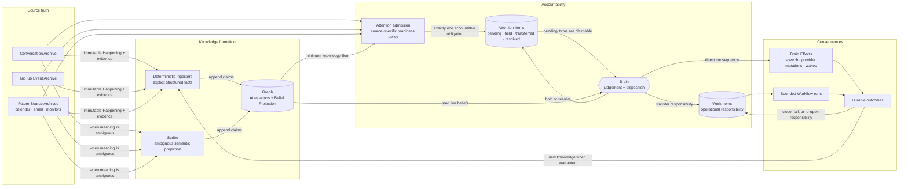
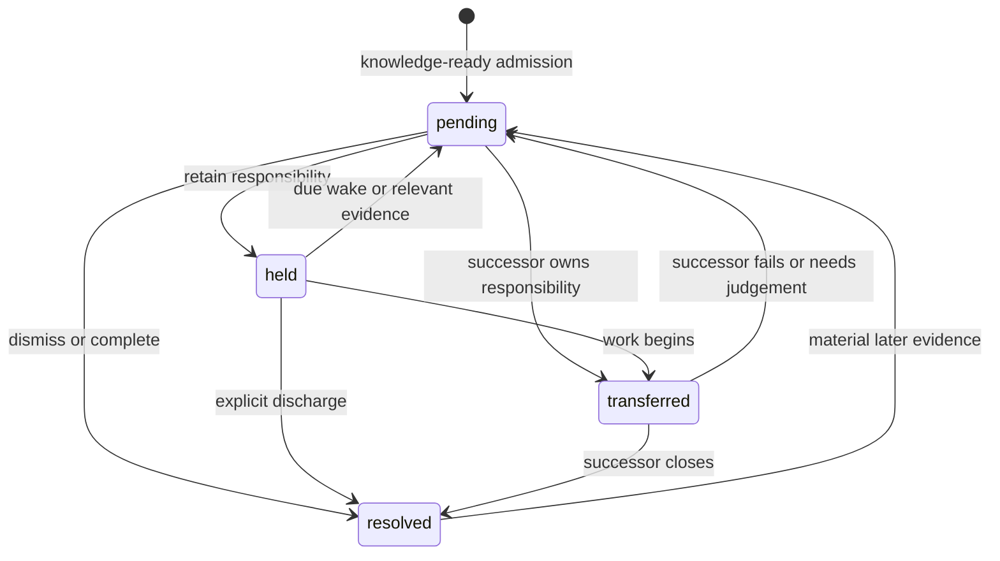
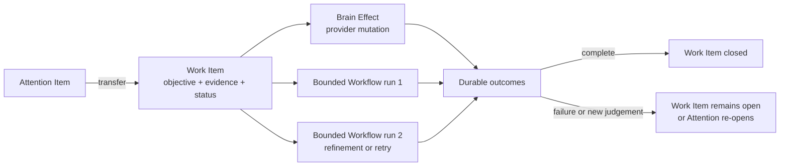

# From information to accountability

This document explains how something that happens in the world becomes knowledge,
attention, work, and finally a closed loop inside the coworker.

It is the detailed reference for the information-to-accountability path defined by
[`SYSTEM-ARCHITECTURE.md`](./SYSTEM-ARCHITECTURE.md). That document remains the conceptual
canon. [`ARCHITECTURE.md`](./ARCHITECTURE.md) maps the concepts to package ownership, and
[`CONTEXT.md`](../CONTEXT.md) defines the ratified language.

> **Implementation boundary:** this is the accepted target architecture. Some foundations
> already exist, but the full ordered path does not. The current distance is recorded in
> `SYSTEM-ARCHITECTURE.md` §13 and summarized in §12 below.

---

## 1. The problem this architecture solves

An external callback proves only that the application received bytes. It does not prove
that the coworker:

1. retained the occurrence under a stable identity;
2. learned the facts needed to judge it;
3. decided whether it mattered;
4. accepted, transferred, held, or discharged responsibility; or
5. observed the outcome of any resulting work.

Those are different proofs. Collapsing them creates the failure at the heart of
[decision #406](https://github.com/AaronAbuUsama/ambient-agent/issues/406): a Brain Batch can
settle because one effect completed even though some of its inputs have no durable
disposition. `stay_silent` can currently be that effect. The system then proves that the
Brain chose not to speak about _something_, not that it accounted for every thing it
claimed.

The architecture fixes that by making the proof chain explicit:

```text
receipt → knowledge readiness → accountable judgement → owned work → observed outcome
```

Each arrow has one durable record and one owner. No record is asked to prove two different
kinds of truth.

---

## 2. The complete system at a glance



There is one ordered path for external Happenings. A provider callback is never a peer of
the knowledge derived from it, and a later Graph delta is never treated as a second
occurrence. The Brain sees one knowledge-ready Attention Item with evidence references,
then reads the current Graph and exact source evidence when deciding.

Internal signals that are already meaningful—Speaker Intents, workflow outcomes, Directive
Outcomes, Scheduled Wakes, and Proactive Sweeps—do not pretend to be provider Happenings,
but they also do not enter the Brain as unowned peers. Before claim, each signal must
correlate to the Attention, Work, Effect, or Directive responsibility it advances. A signal
with no durable owner first creates an Attention obligation; a Proactive Sweep is only a
claim trigger and never a Batch obligation of its own.

---

## 3. Source truth and Happenings

### Source Archives

A **Source Archive** is the durable, provider-specific record of what was observed. The
Conversation Archive is the WhatsApp example. GitHub needs an equivalent delivery/event
archive, and future sources need archives appropriate to their own identity and ordering
rules.

A Source Archive owns:

- the provider's stable delivery or event identity;
- the immutable payload or a lossless normalized representation;
- occurrence and receipt time;
- redelivery/deduplication evidence; and
- enough provenance to retrieve exact source detail later.

It does not own cross-source meaning, operational responsibility, or Brain judgement.

### Happenings

A **Happening** is the source-neutral identity of an occurrence backed by one Source Archive
record. It says, “this happened and this is the evidence.” It does not say:

- what the occurrence means;
- whether it changes a current belief;
- whether the coworker should care;
- whether anyone must act; or
- whether a later action succeeded.

Two deliveries of the same provider occurrence may converge on one Happening. Two distinct
occurrences that happen to produce the same current Graph state remain two Happenings. This
is why the Graph cannot replace the occurrence ledger.

---

## 4. How knowledge is formed

The minimum knowledge floor is source-specific. It is the smallest set of reliable facts
the Brain needs to judge a Happening without parsing raw provider payloads.

There are two projection paths into one Graph.

### Deterministic ingesters

Trusted code appends facts that are explicit in structured source records. Examples:

- a GitHub review's repository, pull request, author, state, and review id;
- a calendar event's organizer, attendees, start time, and cancellation state;
- a WhatsApp event's sender, Surface, timestamp, and message evidence.

No model is needed to copy an explicit field into an evidence-backed Attestation. These
facts are anchored, repeatable, cheap, and suitable for readiness gates.

### The Scribe

The Scribe projects meaning that cannot be recovered reliably by field mapping. Examples:

- “I will send the contract tomorrow” expresses a Commitment;
- two handles appear to refer to one Person;
- a discussion is about a repository even though no repository id appears;
- a message changes the social meaning of an earlier promise.

Each Scribe attempt is stateless and bounded. It appends low-confidence, evidence-backed
proposals. It does not rule on their truth, create Work Items, decide that the Brain must
act, or hold operational responsibility.

### Readiness policy

Attention admission waits for the source's declared minimum floor, not for perfect
knowledge. A structured event may be ready after deterministic Attestations exist. An
ambiguous conversational Happening may require a Scribe attempt to finish before it is
ready. Optional enrichment may continue later.

The policy must be explicit for each Happening kind:

```text
Happening kind
  → required deterministic facts
  → required semantic projection, if any
  → finite projection attempt or elapsed-time budget
  → explicit source-scope admission rule
  → one Attention Item
```

Projection failure is bounded accountability, not an infinite readiness wait. When the
declared budget is exhausted, trusted code records the durable failed attempt ids and a
sanitized terminal reason. That failure record plus the Happening's deterministic identity
is prepared evidence: it admits the same Attention Item so the Brain can hold, transfer, or
resolve the failure explicitly. A later successful projection enriches the same obligation;
it never creates a second Attention Item for the Happening.

Routine Graph changes do not automatically wake the Brain. The admission policy creates
Attention for every accepted, in-scope external Happening. Semantic enrichment that is not
itself a new Happening creates Attention only when accountability or an authoritative
ruling is actually owed.

---

## 5. Why Scribe and Brain are separate

The Scribe and Brain both reason, but they do not do the same job.

| Concern | Scribe | Brain |
| --- | --- | --- |
| Question | “What might this evidence mean?” | “Given what we know, what are we responsible for?” |
| Clock | Global ingestion clock | Reactive and proactive judgement clocks |
| Conversation lifetime | Fresh, stateless attempt | Continuing global mind |
| Authority | Proposal author | Ruling and disposition authority |
| Output | Attestations | Attention dispositions, Work Items, Effects, rulings |
| Failure domain | Retryable projection with bounded escalation | Recoverable accountable decision |
| Volume | Raw ambiguous evidence stream | Decision-worthy knowledge-ready obligations |

Keeping them separate protects three boundaries:

1. **Throughput.** Semantic extraction can run concurrently without serializing the Brain
   on the raw evidence firehose.
2. **Authority.** A proposal can be tentative without becoming a ruling or an action.
3. **Accountability.** The component discovering meaning cannot silently decide that no
   responsibility remains.

The Brain may inspect source evidence and append a ruling. Ordinary Entity and Relation
extraction does not belong on its tool surface. If the Brain routinely re-extracts what the
Scribe should project, the separation has failed.

---

## 6. Knowledge-ready Attention

The Graph and Attention answer different questions:

| Store | Question | Lifetime |
| --- | --- | --- |
| Source Archive / Happening | What occurred? | Permanent source evidence |
| Graph | What does the coworker currently believe? | Persistent, rebuildable memory |
| Attention Item | What occurrence still requires accountable judgement? | Permanent accountability history |

An external-source **Attention Item** is admitted only after its Happening reaches the
minimum knowledge floor. A bounded terminal projection failure counts as a prepared
knowledge-floor fact, not as successful semantic extraction. An ownerless internal signal
instead names its durable internal-input record directly; it is not recast as a provider
Happening. Conceptually the durable contract separates immutable identity, append-only
claims, and append-only transitions:

```ts
type AttentionSource =
  | {
      kind: "happenings";
      happeningIds: [string, ...string[]];
    }
  | {
      kind: "internal_input";
      internalInputId: string;
      internalInputKind: string;
    };

type AttentionItem = {
  attentionId: string;
  source: AttentionSource;
  evidenceIds: string[];
  readiness:
    | {
        kind: "ready";
        attestationIds: string[];
        projectionVersion: string;
      }
    | {
        kind: "projection_failed";
        deterministicAttestationIds: string[];
        attemptIds: string[];
        terminalReason: string;
      };
  createdAt: string;
};

type AttentionClaim = {
  claimId: string;
  attentionId: string;
  batchId: string;
  claimedAt: string;
};

type AttentionState = "pending" | "held" | "transferred" | "resolved";

type EnrichmentTransition = {
  [State in AttentionState]: {
    transitionId: string;
    attentionId: string;
    claimId?: never;
    from: State;
    to: State;
    transition: {
      kind: "enriched";
      attestationIds: string[];
      projectionVersion: string;
      material: boolean;
    };
    recordedAt: string;
  };
}[AttentionState];

type AttentionTransition =
  | {
      transitionId: string;
      attentionId: string;
      claimId?: never;
      from?: never;
      to: "pending";
      transition: { kind: "admitted" };
      recordedAt: string;
    }
  | {
      transitionId: string;
      attentionId: string;
      claimId?: never;
      from: "held" | "transferred" | "resolved";
      to: "pending";
      transition: { kind: "reopened"; reason: string };
      recordedAt: string;
    }
  | EnrichmentTransition
  | {
      transitionId: string;
      attentionId: string;
      claimId: string;
      from: "pending";
      to: "held" | "transferred" | "resolved";
      transition: AttentionDisposition;
      recordedAt: string;
    };
```

This is a conceptual contract, not a frozen database schema. The invariants matter:

- exactly one Attention Item is admitted for every accepted, in-scope Happening;
- each item names either one or more real Happenings or one durable internal-input record,
  never a fabricated or empty Happening list;
- it references immutable evidence and the knowledge floor that made it ready;
- it never copies the Graph;
- pending is queue state, not the record's whole lifetime; and
- reading or claiming it does not erase it;
- every Batch claim is a new immutable record; and
- every disposition or reopening appends a transition rather than clearing or replacing
  an earlier `batchId` or disposition.

The current Attention state is a deterministic projection over its transition history.
Claimability is derived from that current state plus uncovered open claims. A due wake or
failed successor appends `held/transferred → pending`, after which a later Brain Batch
appends a new claim. A later successful projection appends a state-preserving enrichment
transition; material meaning may then append a separate `held/transferred/resolved → pending`
reopening for the same Attention Item. Earlier claims, dispositions, and the original
readiness failure remain permanently inspectable.

The Brain reads the live Belief Projection when deciding. If current belief differs from
the recorded readiness evidence or version, that is useful context, not corruption. When
exact detail matters, the Brain follows the evidence references to the Source Archive.

### Internal input ownership

Internal signals reuse the accountability owner that already exists. This prevents one
WhatsApp message from producing both a source-derived Attention Item and a second,
uncorrelated Speaker Intent obligation.

| Signal | Required durable correlation before Brain claim |
| --- | --- |
| Speaker Intent derived from a message | The originating Happening's Attention Item; it is context for that obligation, not a peer obligation |
| Workflow or Directive Outcome | The exact Work Item, Effect, or Directive whose state it advances |
| Scheduled Wake | The held Attention Item or unfinished Work Item being reconsidered |
| Proactive Sweep | None; it triggers claiming existing pending or due owners and is not itself a Batch input |
| Independent internal intent with no owner | A newly admitted Attention Item referencing the durable internal-input record |

Every claimed internal signal retains its own stable input identity for crash recovery, but
settlement must also name the durable owner and state transition that consumed it. An
ambiguous outcome may reopen its existing Attention Item or admit a new one for fresh
judgement. Merely including the signal in a settled Batch is not coverage.

### Attention state



- **pending** — claimable and not yet dispositioned;
- **held** — the Brain deliberately retains responsibility, optionally with a Scheduled
  Wake;
- **transferred** — a named durable Work Item or accountable effect now owns the next
  outcome;
- **resolved** — no responsibility remains; the reason and outcome are explicit.

An **Open Loop** is the derived view of pending or held Attention, unresolved transferred
successors, unfinished Work Items, and unfulfilled Commitments. It is not another queue or
table that needs a parallel lifecycle.

---

## 7. Brain judgement and disposition

Trusted application code claims a bounded immutable set of pending Attention Items and
owner-correlated internal signals as one Brain Batch. The Brain may consider them together,
but settlement is checked per immutable claim.

Every claimed item must end the Batch in one of these states:

```ts
type AttentionDisposition =
  | { kind: "held"; reason: string; wakeId?: string }
  | {
      kind: "transferred";
      target: { kind: "brain_effect" | "work_item"; id: string };
    }
  | {
      kind: "resolved";
      outcome: "dismissed" | "completed" | "superseded";
      reason: string;
    };
```

Settlement is therefore a coverage check over every claimed input:

```text
for every Attention claim in the Batch:
  exactly one claim-linked transition must leave pending
  any transferred successor must exist durably

for every claimed internal signal:
  its durable Attention, Work, Effect, or Directive owner must be named
  the state transition or explicit consumption must be recorded
  any new judgement obligation must exist as Attention

for every accepted asynchronous consequence:
  a recovery owner must exist
```

Batch-level effect counting is insufficient because one consequence may cover only one of
many inputs.

### Silence is not a disposition

`stay_silent` answers one question: “should the coworker communicate externally now?” It
does not answer what happened to responsibility.

Valid combinations include:

```text
stay silent + resolve as dismissed
stay silent + hold until CI finishes
stay silent + transfer to Work Item W7
speak + resolve
speak + hold
speak + transfer
```

Speech and Attention are orthogonal. A system may correctly say nothing while still doing
work, or correctly speak while retaining an unresolved loop.

---

## 8. Work and closure

A **Work Item** is the Brain's durable operational responsibility. It is created when the
answer to an Attention Item or Intent is “something must be done,” and it survives the
particular mechanism used to do it.



The distinctions are deliberate:

- a **Commitment** is a social belief that someone promised something;
- an **Attention Item** is an obligation to judge an occurrence;
- a **Work Item** is operational responsibility to achieve an outcome;
- a **Brain Effect** is one chosen consequence and durable outbox record;
- a **Bounded Workflow run** is one execution attempt;
- a **Scheduled Wake** is a future prompt, not the owner of the loop; and
- a GitHub issue or pull request is an external artifact, not the internal responsibility
  ledger.

The existing Specialist launch ledger is an execution ledger. The target adds a thin Work
Item above it so one responsibility may exist before dispatch, use no Specialist, or span
several attempts without changing identity.

A Work Item closes only from an observable outcome. Starting a workflow, issuing an API
request, or receiving an ambiguous provider response is not completion.

---

## 9. End-to-end walkthroughs

### GitHub review requests changes

```text
GitHub delivery/event archive records review R42
→ Happening H42 references the immutable review evidence
→ deterministic ingester appends repository, PR, author, state, review-id facts
→ readiness policy admits Attention A42
→ Brain reads the Graph and exact review evidence
→ Brain transfers A42 to Work Item W7: address requested changes
→ W7 launches one Coder workflow attempt
→ the attempt opens or updates a PR
→ workflow result and later GitHub Happenings update W7
→ W7 closes only when its defined outcome is observed
```

The GitHub callback is not sent raw to the Brain. The Attestations are not a second peer
input. They establish readiness for one Attention Item.

### A WhatsApp commitment

```text
Conversation Archive records message M9
→ Happening H9 references M9
→ deterministic facts identify sender, Surface, and time
→ Scribe proposes a Commitment backed by M9
→ readiness policy admits Attention A9 because follow-up ownership is owed
→ Brain holds A9 with a named reason and schedules a wake
→ later evidence marks the Commitment fulfilled
→ the Brain resolves A9, or creates Work if intervention is required
```

The Graph preserves the Commitment as memory. Attention preserves whether the coworker has
accounted for following it up. Neither replaces the other.

### Calendar event changes

```text
Calendar archive records change C3
→ deterministic ingester appends event identity, time, attendees, and state
→ source-scope policy accepts it as an in-scope Happening
→ Attention A3 is admitted
→ Brain prompts the relevant Surface and resolves A3 after durable delivery,
  or holds/transfers it if further action remains
```

A provider sync observation that is explicitly outside the accepted source scope may remain
in the archive without creating a Happening or Attention. Once accepted as an in-scope
Happening, even a no-op refresh receives Attention so its dismissal is accountable.

### Irrelevant provider event

```text
Source Archive records H88
→ minimum knowledge floor is established
→ policy admits A88 because a judgement is still required
→ Brain determines it is an automated echo
→ Brain records stay_silent
→ Brain resolves A88 as dismissed with a reason
```

Silence records communication policy. The dismissal records accountability.

---

## 10. Failure and recovery

| Failure | Durable owner | Recovery |
| --- | --- | --- |
| Process dies after source receipt | Source Archive / Happening | Re-run knowledge readiness idempotently |
| Deterministic projection retries | Attestation identity + evidence | Deduplicate exact claims |
| Scribe attempt dies | Scribe attempt ledger | Retry fresh attempt against same evidence |
| Scribe projection exhausts its source-policy budget | Happening + terminal attempt evidence | Admit the same Attention Item with prepared projection-failure evidence; later enrichment does not duplicate it |
| Projection completes before Attention admission | Readiness policy frontier | Admit the same Attention Item idempotently |
| Brain dies while deciding | Brain Batch + exact Attention membership | Recover the same open Batch |
| Brain tries to settle uncovered input | Attention coverage check | Reject settlement |
| Scheduled Wake delivery repeats | Wake identity | Admit at least once; disposition remains authoritative |
| Effect crosses provider boundary ambiguously | Effect/provider delivery record | Reconcile; never assume success or blindly repeat |
| Workflow dies | Execution ledger | Return interrupted outcome; Work Item stays open |
| Successor fails after transfer | Work/Effect lifecycle | Re-open judgement or keep responsibility visible |

At-least-once delivery is acceptable because identities and transitions are durable and
idempotent. Silent loss is not.

---

## 11. Invariants and forbidden collapses

Any implementation must preserve these invariants:

1. Every accepted external occurrence has one immutable Happening identity.
2. The Brain never needs to parse an unprepared provider callback to decide.
3. Every accepted, in-scope Happening admits exactly one knowledge-ready Attention Item.
4. Every Brain Batch claim and every Attention state transition is append-only.
5. Every Attention claim in a Brain Batch receives an explicit durable disposition.
6. `stay_silent` never settles Attention.
7. A transferred disposition names a durable successor that owns recovery.
8. Graph beliefs never substitute for occurrence, Attention, or operational work state.
9. Routine semantic projection does not automatically interrupt the Brain.
10. Projection retries have a finite policy budget whose exhaustion becomes Attention.
11. Work closes from an observable outcome, not admission or attempted execution.
12. Exact source evidence remains reachable from every derived fact and decision.

The following shortcuts violate the architecture:

- sending raw provider callbacks directly to the Brain;
- admitting raw occurrence and later Graph delta as peer Brain inputs;
- using the Graph as an event queue or provider mirror;
- deleting Attention after it is read;
- treating a Scheduled Wake as the open loop;
- treating one completed Effect as coverage for a whole Brain Batch;
- putting operational Work state into confidence-bearing Graph beliefs; or
- collapsing deterministic ingestion, semantic projection, judgement, and action into one
  model turn.

---

## 12. Current implementation versus target

The existing code provides much of the durability needed for the target:

- provider-specific conversation and GitHub receipt records;
- append-only Attestations and a derived Belief Projection;
- a durable global Scribe inbox, batch, retry, and replay mechanism;
- immutable Brain Batches with crash-stable input membership;
- durable Brain Effects, Scheduled Wakes, Specialist launches, and outcomes; and
- recovery for several asynchronous effect and workflow paths.

The important gaps are architectural, not merely naming:

- raw GitHub events and Scribe Knowledge Deltas currently enter the Brain inbox as peer
  inputs;
- routine Scribe success currently wakes the Brain;
- there is no source-neutral knowledge-readiness/admission frontier;
- Scribe retries have no cumulative terminal readiness-failure escalation;
- there is no durable per-input Attention identity, claim, and transition history;
- Brain Batch settlement counts consequences instead of proving input coverage;
- `stay_silent` can satisfy the current Batch consequence floor; and
- the existing Specialist launch ledger does not represent generic Work responsibility.

Until those gaps close, “Brain Batch settled” is mechanical progress, not proof that every
Happening was processed accountably.

---

## 13. Code ownership and extension guide

The package rules remain simple:

| Concern | Owner |
| --- | --- |
| Durable Source Archive, Happening, Attention, Batch, Effect, and Work stores | `packages/engine` |
| Deterministic source normalization and readiness mechanics | `packages/engine` |
| Scribe and Brain identities, prompts, judgement policy, and tools | `packages/agents` |
| Shared kinds of executable work | `packages/agents/src/capabilities` |
| Installation-specific provider credentials and lifecycle | `packages/installation` |
| Runtime composition and provider adapter wiring | `apps/runtime` |

When adding a source:

1. retain provider truth under a stable source identity;
2. define its Happening identity and exact evidence references;
3. implement deterministic facts explicit in the record;
4. state whether semantic projection is required;
5. define the source-scope rule and minimum knowledge floor;
6. idempotently admit one Attention Item;
7. reuse the existing Brain disposition and Work lifecycle; and
8. leave the smallest runnable recovery and coverage checks.

A new source should add an archive adapter and readiness policy. It should not add another
Brain, another Graph, another occurrence queue disguised as memory, or a bespoke work
lifecycle.
