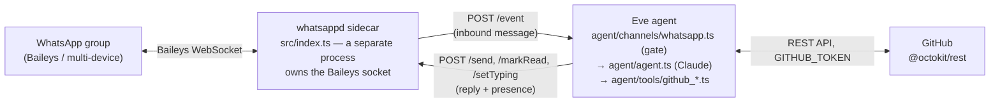

# Building a WhatsApp GitHub Concierge with Eve and whatsappd

This is the full walkthrough for `whatsappd-github-agent`: a bot that lives
in a WhatsApp group and operates a GitHub repository on request — opening and
triaging issues, reviewing pull requests, summarizing code, all from chat.
It's also a working tutorial on the two libraries underneath it:
[Eve](https://eve.dev), the agent runtime, and
[whatsappd](https://github.com/AaronAbuUsama/whatsappd), the WhatsApp
channel. Every snippet below is real code from this repository, not
pseudocode.

## Table of contents

1. [What this is](#1-what-this-is)
2. [Prerequisites](#2-prerequisites)
3. [Install](#3-install)
4. [Eve basics: how this agent is built](#4-eve-basics-how-this-agent-is-built)
5. [whatsappd basics: pairing, sessions, the Eve adapter](#5-whatsappd-basics-pairing-sessions-the-eve-adapter)
6. [Wiring the GitHub tools](#6-wiring-the-github-tools)
7. [Running the bot](#7-running-the-bot)
8. [Deployment notes and the WhatsApp ban-risk caveat](#8-deployment-notes-and-the-whatsapp-ban-risk-caveat)

## 1. What this is

Two processes, three hops:



```
WhatsApp group  <-- Baileys -->  whatsappd sidecar  <-- HTTP -->  Eve agent  <-- REST -->  GitHub
                                  (src/index.ts,                   (agent/),
                                   a separate process)               GITHUB_TOKEN
```

- **The sidecar** (`src/index.ts`, wrapping whatsappd's `runSidecar()`) is
  the only process that ever touches the WhatsApp WebSocket. It POSTs every
  inbound event to the Eve app and exposes `/send`, `/markRead`, `/setTyping`
  for the Eve app to call back.
- **The Eve agent** (`agent/`) is a normal Eve app: `agent.ts` picks the
  model, `instructions.md` sets the persona, `tools/github_*.ts` are the
  GitHub operations, and `channels/whatsapp.ts` is the only ingress — it
  decides whether an inbound WhatsApp event is even allowed to start a
  session before anything reaches the model.
- **GitHub** is reached with `@octokit/rest` and a personal access token —
  no GitHub App, no webhook on GitHub's side. All the automation is driven
  from the WhatsApp side.

These are genuinely two processes because that's how whatsappd is designed:
one sidecar owns exactly one WhatsApp number's socket, and any HTTP-speaking
app — Eve or otherwise — can sit behind it. Sections 5–7 walk through wiring
and running both.

## 2. Prerequisites

- **Node.js ≥ 22** to install and test this repo. **Node.js ≥ 24 specifically
  to run the Eve agent** (`eve dev` / `eve build` / `eve start`) — the `eve`
  CLI checks its own Node version at startup and refuses to run below 24,
  independent of what any `package.json` `engines` field says. (`npm install`,
  `npm run typecheck`, and `npm test` all work fine on Node 22 — only the
  `eve` binary itself enforces 24. See [STATUS.md](../STATUS.md) for how this
  was verified.)
- **A GitHub personal access token** with `repo` scope (issues, pull
  requests, contents, code search) — [Settings → Developer settings → Personal
  access tokens](https://github.com/settings/tokens). A fine-grained token
  scoped to just the repo you want the bot on works too.
- **An Anthropic API key** — [console.anthropic.com](https://console.anthropic.com/).
  This project calls Claude directly (no Vercel account, no AI Gateway).
- **A WhatsApp number you can afford to lose.** See [§8](#8-deployment-notes-and-the-whatsapp-ban-risk-caveat)
  before you pair your daily-driver number.
- **`gh`** (GitHub CLI) if you want to try the example commands against a
  scratch repo — not required to run the bot itself.

## 3. Install

```bash
git clone https://github.com/AaronAbuUsama/whatsappd-github-agent.git
cd whatsappd-github-agent
npm install
cp .env.example .env
```

Open `.env` and fill in at least `GITHUB_TOKEN`, `GITHUB_REPO`, and
`ANTHROPIC_API_KEY`. The WhatsApp variables are covered in [§5](#5-whatsappd-basics-pairing-sessions-the-eve-adapter).

## 4. Eve basics: how this agent is built

Eve is filesystem-first: you don't hand it one big config object, you put
files in specific folders under `agent/`, and the file's location decides
what it becomes. This project uses four of those folders.

### `agent/agent.ts` — model config

```ts
// agent/agent.ts
import { anthropic } from "@ai-sdk/anthropic";
import { defineAgent } from "eve";

const modelId = process.env.EVE_MODEL_ID ?? "claude-sonnet-5";

export default defineAgent({
  model: anthropic(modelId),
  limits: {
    maxOutputTokensPerSession: 200_000,
  },
});
```

`defineAgent` takes a `model`. Eve supports two routing modes: a gateway
model-id string like `"anthropic/claude-sonnet-5"` (routes through Vercel's
AI Gateway, needs a Vercel project or `AI_GATEWAY_API_KEY`), or a direct AI
SDK provider object like `anthropic(modelId)` from `@ai-sdk/anthropic` (calls
Anthropic directly, needs `ANTHROPIC_API_KEY`). This project uses the direct
form on purpose — running the bot needs nothing from Vercel.

### `agent/instructions.md` — the persona

This is the agent's permanent system prompt; Eve prepends it to every model
call in the session. Ours sets up the "GitHub Concierge" persona: when to
act, how to handle destructive actions, how to write chat-length replies.
One excerpt (the full file is [`agent/instructions.md`](../agent/instructions.md)):

```md
## When to act

The channel only starts a turn when a message in the watched group contains
the configured trigger (default `@github-bot`) — every message you see was
already addressed to you. You do not need to re-check for a mention. Just
answer the request in that message.
```

Note what that instruction leans on: by the time a message reaches the
model, `agent/channels/whatsapp.ts` has already decided it's addressed to
the bot (§5 and §6 cover how). The persona doesn't have to re-derive that —
it's a fact of being in this session at all.

### `agent/tools/*.ts` — typed actions

A file under `agent/tools/` becomes a tool the model can call; the filename
(snake_case) is the tool's name. Here's the whole `github_create_issue.ts`:

```ts
// agent/tools/github_create_issue.ts
import { defineTool } from "eve/tools";
import { z } from "zod";
import { getOctokit, resolveWritableRepo } from "../lib/github.ts";

export default defineTool({
  description:
    "Create a new GitHub issue. Defaults to the GITHUB_REPO repo when owner/repo are omitted. " +
    "Use this for bug reports, feature requests, or anything raised in chat that should be tracked.",
  inputSchema: z.object({
    owner: z.string().optional().describe("Repo owner/org. Defaults to GITHUB_REPO."),
    repo: z.string().optional().describe("Repo name. Defaults to GITHUB_REPO."),
    title: z.string().min(1).describe("Issue title — short and specific."),
    body: z.string().optional().describe("Issue body in GitHub-flavored markdown."),
    labels: z.array(z.string()).optional().describe("Label names to apply, if any already exist."),
    assignees: z.array(z.string()).optional().describe("GitHub usernames to assign."),
  }),
  async execute(input) {
    const { owner, repo } = resolveWritableRepo(input);
    const octokit = getOctokit();
    const { data } = await octokit.rest.issues.create({
      owner,
      repo,
      title: input.title,
      body: input.body,
      labels: input.labels,
      assignees: input.assignees,
    });
    return { number: data.number, url: data.html_url, title: data.title, state: data.state };
  },
});
```

`description` is what the model reads to decide when to call this; write it
for the model, not for a human reading the source. `inputSchema` is a Zod
schema — Eve infers `execute`'s input type from it, so `input.title` is
already typed as a non-empty string with no manual casting. `execute` runs
in your normal Node runtime (full `process.env`, no sandbox), so it can be
tested exactly like a regular async function — see [§6](#6-wiring-the-github-tools)
and [`tests/tools/`](../tests/tools).

Write tools (create/comment/close/review/label/assign) resolve through
`resolveWritableRepo` rather than `resolveRepo` — same resolution, but it also
enforces a **write allow-list**, so a repo named in a chat message can't be
written to unless it's on `GITHUB_ALLOWED_REPOS` (see [§6](#6-wiring-the-github-tools)).
There are thirteen tools in all — see the [tool table in the README](../README.md#what-it-does)
for the full list.

### `agent/channels/whatsapp.ts` — the ingress

Channels are how a platform reaches an Eve agent at all; a channel decides
whether and how to start a session. This is the one piece of this project
that isn't "just" following the Eve docs, because a group-chat bot with
GitHub *write* access has a requirement a generic channel doesn't: not
every message in the group should reach the model, and not every WhatsApp
contact who can message the bot's number should be able to trigger a GitHub
write. `agent/channels/whatsapp.ts` builds that gate on top of whatsappd's
adapter — full explanation in [§6](#6-wiring-the-github-tools).

### Building and running

```bash
npm run typecheck   # tsc --noEmit — works on Node >= 22
npm test             # vitest — works on Node >= 22, no network needed
npm run build         # eve build → .eve/ + .output/ — needs Node >= 24
npm run dev            # eve dev — the interactive dev server + TUI, needs Node >= 24
```

`eve build` is a genuine, offline compile step: it discovers every file
under `agent/`, typechecks and bundles it, and writes `.eve/discovery/diagnostics.json`
(errors/warnings) plus a runnable `.output/`. It does **not** need Vercel
credentials or a model key to succeed — building doesn't call the model.
Run `npx eve info` any time to see exactly what Eve discovered (tools,
channels, instructions) and confirm it matches what you expect.

## 5. whatsappd basics: pairing, sessions, the Eve adapter

whatsappd wraps [Baileys](https://github.com/WhiskeySockets/Baileys) (an
unofficial WhatsApp Web client) behind a typed session API and, on top of
that, an HTTP **sidecar** — a small server that owns the Baileys socket and
exposes it over plain HTTP so a framework like Eve never has to import
anything WhatsApp-specific.

### Pairing a number

The sidecar is a single command, configured entirely by environment
variables (see `.env.example`):

```bash
npm run whatsapp
```

Under the hood this runs [`src/index.ts`](../src/index.ts), a thin wrapper
around whatsappd's `runSidecar()` that validates the env vars this project
needs and prints setup guidance before handing off:

```ts
// src/index.ts (excerpt)
import { runSidecar } from "whatsappd/sidecar";

const sidecar = await runSidecar();
console.log(`whatsappd sidecar listening on :${sidecar.port}`);
console.log("Scan the QR above in WhatsApp -> Linked devices (first run only).");
```

On first run it prints a QR code to the terminal. Open WhatsApp on the phone
you're pairing → **Settings → Linked devices → Link a device** → scan it.
Prefer a pairing code instead of a QR? Set `WHATSAPP_PAIRING_PHONE=+15551234567`
(E.164 format) in `.env` before starting the sidecar, and it'll print a code
to type into WhatsApp instead.

Credentials persist under `WHATSAPP_STORE_DIR` (default `./.wa-auth`), so
you only pair once — restarts reconnect silently. That directory holds live
session credentials; **never commit it** (this repo's `.gitignore` already
excludes `.wa-auth*/`) and never copy an existing `.wa-auth*` directory from
another project into this one, or vice versa — pair fresh for each bot
instance. Two processes pointed at the same credentials will fight over the
one linked-device slot and kick each other off.

**Verify a pairing without sending anything.** Before wiring the bot into a
group, confirm the credentials actually connect, using the bundled probe:

```bash
npx tsx scripts/whatsapp-dry-run.ts ./.wa-auth
```

It connects, prints the status phase it reaches, and disconnects — it never
sends, reads, or marks a message. A completed pairing reaches `online`; an
empty store stops at `pairing` (scan needed); a store whose device was removed
reports `logged_out` with reason `logged_out_remote` (pair again). It's the
fastest way to catch a dead `.wa-auth` before debugging the whole pipeline.

### Sessions and the Eve adapter

whatsappd models one WhatsApp conversation (a DM or a group) as one ongoing
thing you `send()` to and receive events from — see the
[whatsappd README](https://github.com/AaronAbuUsama/whatsappd#readme) for
the full session API if you're building something that talks to WhatsApp
directly. This project doesn't touch that API itself; it uses whatsappd's
**Eve adapter** (`whatsappd/adapters/eve`), which bridges a sidecar to an
Eve app for you: one WhatsApp chat maps to one Eve session, keyed by chat ID
as the `continuationToken`.

The stock adapter (`export { default } from "whatsappd/adapters/eve"`)
starts an Eve session for *every* inbound message — right for a 1:1
assistant, wrong here (see §6 for why). This project instead imports the
adapter's individual building blocks — `toUserContent`, `createEventHandlers`,
`createFetchFile` — and supplies its own gated route in their place. That's
the "or configure explicitly" path the whatsappd README mentions.

### Wiring the two processes together

The sidecar needs to know where to POST inbound events
(`WHATSAPP_FORWARD_URLS`), and the Eve channel needs to know how to reach
the sidecar back (`WHATSAPP_SIDECAR_URL`). One important, easy-to-get-wrong
detail: Eve mounts a channel's routes at their **literal declared path**,
not nested under `/channels/<name>/`. `agent/channels/whatsapp.ts` declares
`POST("/event", ...)`, so during local dev (default port 2000) the sidecar's
forward URL is:

```bash
# .env
WHATSAPP_FORWARD_URLS=http://localhost:2000/event
WHATSAPP_SIDECAR_URL=http://localhost:8788
WHATSAPP_SIDECAR_TOKEN=<openssl rand -hex 32>
```

(This was verified empirically against a running `eve dev` server while
building this project — `eve info --json` prints each channel's real
`urlPath`, which is the fastest way to double-check it after any change.)

## 6. Wiring the GitHub tools

### `agent/lib/github.ts` — one Octokit client, one repo resolver

Every tool shares two small helpers instead of duplicating auth and
repo-defaulting logic:

```ts
// agent/lib/github.ts (excerpt)
export function getOctokit(): Octokit {
  if (client) return client;
  const auth = process.env.GITHUB_TOKEN;
  if (!auth) throw new Error("GITHUB_TOKEN is not set. ...");
  client = new Octokit({ auth, userAgent: "whatsappd-github-agent" });
  return client;
}

export function resolveRepo(input: { owner?: string; repo?: string }): RepoRef {
  if (input.owner && input.repo) return { owner: input.owner, repo: input.repo };
  const fallback = process.env.GITHUB_REPO; // "owner/repo"
  // ... falls back per-field, throws a clear error if nothing resolves
}

// Read tools use resolveRepo; write tools use this, which ALSO enforces the
// allow-list so untrusted chat text can't redirect a write to any repo.
export function resolveWritableRepo(input: RepoInput): RepoRef {
  const ref = resolveRepo(input);
  const allowed = allowedWriteRepos(); // GITHUB_ALLOWED_REPOS, defaults to [GITHUB_REPO]
  if (!allowed.has(`${ref.owner}/${ref.repo}`.toLowerCase())) throw new Error("not in the write allow-list");
  return ref;
}
```

`getOctokit` is lazy and memoized — importing the module (which `eve build`
does during discovery) never touches `GITHUB_TOKEN`; only actually calling a
tool does. `resolveRepo` is why every tool's `owner`/`repo` inputs are
optional: "list open issues" works against `GITHUB_REPO` with no repo named,
while "list open issues in acme/other-repo" still works by naming one
explicitly. `lib/` is Eve's designated spot for this kind of import-only
shared code — files there are never discovered as tools themselves.

**The write allow-list is the one security-critical helper here.** Tool inputs
are model output derived from *untrusted* group-chat text, and the channel gate
(below) authorizes by group membership — not by which repo a message names. So
without a guard, "@github-bot open an issue in someone-else/their-repo" would
let anyone in the group turn the bot's token into a write against any repo it
can reach. Every mutating tool (`create`/`comment`/`close`/`review`/`add_labels`/`assign`)
therefore resolves through `resolveWritableRepo`, which refuses any repo outside
`GITHUB_ALLOWED_REPOS` (default: just `GITHUB_REPO`). Reads stay unrestricted —
lower blast radius, and "review PR in acme/widgets" is a legitimate ask.

Every tool in `agent/tools/github_*.ts` follows the same shape: resolve the
repo, call one Octokit method, return a small, model-friendly summary (never
the raw Octokit response — GitHub's API objects are large, and a WhatsApp
reply should stay chat-length). `github_review_pull_request.ts` is worth a
look for how a tool can validate before making an API call at all:

```ts
// agent/tools/github_review_pull_request.ts (excerpt)
async execute(input) {
  if (input.event === "REQUEST_CHANGES" && !input.body) {
    throw new Error("`body` is required when event is REQUEST_CHANGES.");
  }
  // ...
}
```

### Testing the tools without hitting GitHub

Because `execute` is a plain async function and `getOctokit`/`resolveRepo`
are ordinary imports, testing a tool is testing a function — mock the
Octokit call, invoke `.execute(input, ctx)`, assert on the return value and
on what Octokit was called with:

```ts
// tests/tools/issues.test.ts (excerpt)
const mockIssues = { create: vi.fn() /* ...other issues.* methods */ };

vi.mock("../../agent/lib/github.ts", async (importOriginal) => {
  const actual = await importOriginal<typeof import("../../agent/lib/github.ts")>();
  return { ...actual, getOctokit: () => ({ rest: { issues: mockIssues } }) as never };
});

it("creates an issue against the resolved repo and returns a summary", async () => {
  mockIssues.create.mockResolvedValue({ data: { number: 42, html_url: "...", title: "Bug", state: "open" } });
  const { default: tool } = await import("../../agent/tools/github_create_issue.ts");

  const result = await tool.execute({ title: "Bug", body: "It's broken" }, dummyCtx);

  expect(mockIssues.create).toHaveBeenCalledWith(
    expect.objectContaining({ owner: "acme", repo: "widgets", title: "Bug" }),
  );
  expect(result.number).toBe(42);
});
```

`resolveRepo` is kept real (via `importOriginal`) in these tests, so
default-repo behavior is exercised too, not just mocked away. All 41 tests
across `tests/lib/`, `tests/tools/`, and `tests/channels/` run with
`npm test` — no network access, no real `GITHUB_TOKEN`, in about a second.

### Group gating

This is the part that isn't "wire up the tools and you're done." A WhatsApp
number receives messages from anyone who has it; this bot's tools can create
issues, close issues, and post PR reviews. Treating "everyone who messages
the bot's number" as "everyone authorized to write to this repo" would be a
real access-control bug, not just a noisy-bot problem. `agent/channels/whatsapp.ts`
gates every inbound event before it can start a session:

```ts
// agent/channels/whatsapp.ts (excerpt)
export function isAddressed(event: Extract<SidecarEvent, { type: "message" }>): boolean {
  if (event.isGroup) {
    if (GROUP_ALLOWLIST.size > 0) {
      if (!GROUP_ALLOWLIST.has(event.chatId.toLowerCase())) return false;
    } else if (!ALLOW_ANY_GROUP) {
      return false; // fail closed: no group configured → ignore every group
    }
  } else if (!ALLOW_DM) {
    return false; // DMs ignored unless explicitly opted in — see WHATSAPP_ALLOW_DM
  }
  // optional second gate: only allow-listed senders (digit-matched) may trigger
  if (SENDER_ALLOWLIST.size > 0 && !senderAllowed(event.from)) return false;
  return textOf(event.message).toLowerCase().includes(TRIGGER);
}
```

The rules, all **fail-closed** — a misconfiguration silences the bot rather
than exposing it:

- **Group allow-list.** Only groups named in `WHATSAPP_GROUP_ID` /
  `WHATSAPP_GROUP_IDS`. Configure none and the bot ignores *every* group;
  `WHATSAPP_ALLOW_ANY_GROUP=true` is an explicit escape hatch for local testing.
- **Trigger word.** Only messages containing `WHATSAPP_BOT_TRIGGER` (default
  `@github-bot`).
- **Optional sender allow-list.** `WHATSAPP_ALLOWED_SENDERS` (phone numbers or
  JIDs, digit-matched) restricts *who* may trigger writes, beyond mere group
  membership. Unset = any member of an allowed group.
- **DMs off by default.** Opt in with `WHATSAPP_ALLOW_DM=true` for solo testing.

(The sidecar `POST /event` route is separately protected by a constant-time
`WHATSAPP_SIDECAR_TOKEN` bearer check, and warns loudly at startup if it's
unset.)

**Why a plain-text trigger and not a real `@`-mention:** WhatsApp's actual
mention metadata (`contextInfo.mentionedJid`, the list of JIDs someone
`@`-tagged) lives in the Baileys protocol message. whatsappd's sidecar wire
format — the JSON shape that crosses the HTTP boundary from the sidecar to
any framework adapter — deliberately keeps that boundary narrow and doesn't
carry `context`/mentions across it today (see `WireMessage` in
`whatsappd`'s `src/sidecar/wire.ts`). So there's no mention JID available on
this side of the bridge to check against the bot's own identity. Matching
literal text (`"@github-bot"` appearing in the message) is what "addressed"
means in this template — it's honest about being a text convention, not a
real WhatsApp mention, and it's stated as such in the bot's own instructions
and in `.env.example`. If you fork this and need real mention detection,
that's a whatsappd change (extending `WireMessage`/`SidecarEvent` to carry
`context.mentions`), not something fixable from the Eve-app side alone.

Finally, why this lives in the *route* and not just as an instruction
telling the model "only reply when addressed": an instruction only shapes
what the model *says*— the session still starts, tokens still get spent, and
a model that's uncertain can still decide to reply. Gating in
`createGatedEventRoute` (see [`agent/channels/whatsapp.ts`](../agent/channels/whatsapp.ts))
means an unaddressed message never starts a session at all — verified in
[`tests/channels/whatsapp.test.ts`](../tests/channels/whatsapp.test.ts) and,
during development, by posting directly to a running `eve dev` server:

```bash
curl -X POST http://localhost:2000/event -H 'content-type: application/json' -d '{
  "type": "message", "accountId": "acc", "chatId": "GROUP1@g.us", "isGroup": true,
  "from": "111@s.whatsapp.net", "pushName": "Ann",
  "message": { "id": "M1", "chatId": "GROUP1@g.us", "from": "111@s.whatsapp.net",
                "fromMe": false, "timestamp": 1, "isGroup": true,
                "kind": "text", "text": "@github-bot list open issues" }
}'
# → {"sessionId":"wrun_..."}   (an unaddressed message returns {"ignored":true,"reason":"not addressed"})
```

## 7. Running the bot

Two terminals, from the repo root, both loading the same `.env`:

```bash
# terminal 1 — the Eve agent (needs Node >= 24)
npm run dev

# terminal 2 — the whatsappd sidecar (works on Node >= 22 too)
npm run whatsapp
```

`npm run dev` opens Eve's interactive terminal UI, useful for testing the
agent directly with text input before wiring WhatsApp at all. `npm run whatsapp`
prints a QR the first time (§5) — pair it, then send a message in the paired
number's chats.

**Find your group's JID.** Add the bot's number to the target WhatsApp
group, then send any message in it. With `WHATSAPP_GROUP_ID` unset, the
sidecar log and the Eve app both show the inbound `chatId` (something like
`120363012345678901@g.us`) — copy that into `.env` as `WHATSAPP_GROUP_ID`
and restart both processes. From then on, only that group is watched.

**Try it.** In the group:

```
@github-bot open an issue: title "Export button broken on Safari", body "Clicking Export does nothing in Safari 18, works fine in Chrome"
```

```
@github-bot list open issues
```

```
@github-bot summarize PR #12
```

```
@github-bot review PR #12
```

```
@github-bot what does src/index.ts do on main?
```

The agent replies in the same group chat, and for anything that mutates
GitHub (opening an issue, posting a review) the reply includes the resulting
issue/PR number and URL so you can tap through.

## 8. Deployment notes and the WhatsApp ban-risk caveat

**Ban risk is real and specific to this stack.** whatsappd runs on
[Baileys](https://github.com/WhiskeySockets/Baileys), an unofficial,
reverse-engineered implementation of the WhatsApp Web multi-device protocol
— it is not affiliated with or endorsed by WhatsApp/Meta. Automating a
personal WhatsApp number can violate WhatsApp's Terms of Service, and the
number can be **temporarily or permanently banned** with no appeal
guaranteed. Use a number you can afford to lose — a secondary SIM, a VoIP
number, or a dedicated test line — not your primary personal or business
number, at least until you've decided you're comfortable with the risk on
whichever number you do use.

**Deploying the two processes.** They're independent and can live on
different hosts as long as they can reach each other over HTTP:

- The **Eve agent** deploys like any Eve app — see
  [Eve's deployment guide](https://eve.dev/docs/guides/deployment) for the
  Vercel path (`vercel deploy`) or the self-hosted path (`eve build && eve
  start`, needs Node ≥ 24 on the host). Set `GITHUB_TOKEN`, `GITHUB_REPO`,
  `ANTHROPIC_API_KEY`, and the `WHATSAPP_*` variables in the deployment
  environment — never in source.
- The **sidecar** (`npm run whatsapp`, or `npx whatsappd` directly with the
  same env vars) needs a long-running process — it holds the WhatsApp
  WebSocket open — and persistent storage for `WHATSAPP_STORE_DIR` so a
  restart reconnects instead of re-pairing. A small always-on VM or
  container works well; serverless platforms that suspend idle processes
  don't, because the socket needs to stay open to receive messages.
- Set `WHATSAPP_FORWARD_URLS` to the **deployed** Eve app's `/event` URL and
  `WHATSAPP_SIDECAR_URL` to the **deployed** sidecar's URL — both need to be
  reachable from the other process, not `localhost`, once they're not on the
  same machine.
- Rotate `WHATSAPP_SIDECAR_TOKEN` and `GITHUB_TOKEN` like any other
  production secret; both are read from the environment, never hardcoded.

**Scope the token narrowly.** Give `GITHUB_TOKEN` access to only the
repo(s) you actually want the bot operating on — a fine-grained PAT scoped
to one repo is a better fit here than a classic token with blanket `repo`
scope across your whole account/org.
