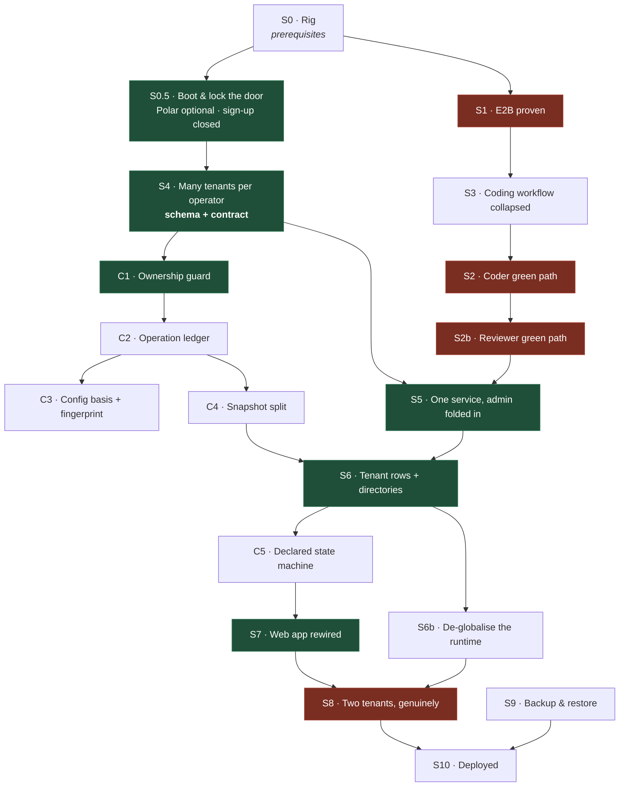

# Rebuild plan — operator-managed multi-tenant service

**Supersedes `REBUILD-HANDOFF.md`.** Written 2026-07-19 against ADRs 0020, 0021, 0022 and 0024.
ADR 0023's demolition of the web app is superseded; its one-service decision stands.

**Revision 2** — the first draft's DAG was invalid. Three adversarial reviews found four
blockers, and this revision is the corrected version. What changed is recorded at the end.

## The one rule

**Every stage gate is a real-world proof.** Real WhatsApp client, real GitHub, real E2B
micro-VM, real model. `pnpm test` stays a *merge* gate and is never a stage gate.

Two clarifications the first draft got wrong:

- **`tests/fixtures/speaker` is never admissible as a stage gate**, including with
  `SPEAKER_FIXTURE_LIVE_MODEL=true`. It composes the real Speaker against a fake WhatsApp host,
  a fake issue repository and a queue-driven ingress. Real model, fake world.
- **Every gate must assert a negative.** The dominant failure mode here is silent degradation —
  the Coder disabling itself with a `console.warn`, the Speaker settling silent, the Scribe
  writing nothing. A suite of "X happened" assertions cannot see any of it. Each gate below
  names the thing that must *not* happen.

### Gates vs prerequisites

A gate must be **re-runnable**; a ceremony performed once is a prerequisite. Pairing a phone is
a prerequisite, never a gate — the first draft violated this in S7 and it is fixed here.

### Cadence and cost

Model inference runs on a flat-rate ChatGPT subscription — there is no per-token invoice, so
"measured cost" is meaningless. Gates record **turn count, token count and wall-clock seconds**.
E2B compute is genuinely cheap (~$0.02–0.07 per Coder job). The binding constraint is
**subscription rate limit on one human's account**: two people running `coder:live` concurrently
produces a flaky gate that looks like a regression. Live gates are **nightly or on-demand, never
per-PR**.

---

## What is proven live

| Capability | Receipt |
|---|---|
| WhatsApp pairing, real send to the canary group, real provider ack | `smoke-battery.md` |
| Paired session surviving restart with no re-QR | `ambience-hard-cut-live.md` |
| Real GitHub webhook delivery, signature-verified, settled in the ledger | `github-webhook-live.md` |
| A real draft PR opened by `ambient-coder[bot]` | `behavior-battery.md` A4 |
| Issue lifecycle against real GitHub, self-cleaning and re-runnable | `tests/speaker/issue-management.live.test.ts` |

**Removed from this table in revision 2:** "a real review under the `ambient-reviewer` App
identity". The receipt records a review submitted **by hand using the App's token**, not by the
Reviewer workflow. `behavior-battery.md:77` says it plainly: *"auth only; no behavior exists."*
The Reviewer is unproven.

Also removed: "live model inference" as a proven capability. The smoke `chatgpt` station asserts
`liveCheck.request === "complete"` — a connectivity probe, not an inference check.

## What has never worked

- **The Coder green path.** Never observed. Root cause is *known and written down*: `/tmp` is
  mounted `noexec` on the rig, so spawning a binary from the temp dir fails `EACCES`. The fix is
  a workspace-local `TMPDIR` (issue #172).
  **This adapter had that fix and I deleted it in `bc93fb9`; revision 2 restores it in
  `packages/installation/src/e2b-sandbox.ts`.** E2B does not fix this bug — it would only hide
  it if a given template happens to mount `/tmp` exec.
- **The Reviewer workflow.** Zero receipts. Additionally dead by configuration: see S2b.
- **E2B.** Zero live evidence.
- **Multi-tenant anything.** One WhatsApp account. Per-tenant sessions unbuilt.
- **Any deploy.** Nothing has ever run on the VPS.

## Four blockers found by review that no earlier plan named

| | Finding | Evidence |
|---|---|---|
| **F-1** | **Two tenants cannot run in one process.** Every runtime binding is a `Symbol.for` process global — coder, reviewer, delegation, issue-management, graph — and `pi-subscription` registers one provider process-wide and monkey-patches `globalThis.fetch`. Tenant B's config overwrites tenant A's. | `packages/engine/src/shared/flue-global.ts:8`, `pi-subscription.ts:38,162-190,297-321` |
| **F-2** | **The API contract has no tenant dimension.** All 14 verbs are `x(userId)`; tenant resolution is `WHERE tenant.user_id = ?`. ADR 0024's claim that the existing verbs are what an operator needs is wrong on the only axis that matters. | `packages/api/src/coworker.ts:158-192,300-306` |
| **F-3** | **The service will not boot with billing "disabled".** The three Polar vars are required, `createCustomerOnSignUp: true` calls Polar on registration, and `getEntitlementSnapshot` hits Polar on the wizard's 3-second poll. | `packages/env/src/server.ts:11-13`, `packages/auth/src/index.ts:41,78` |
| **F-4** | **Sign-up is open to the internet.** Auth is configured and the login page *defaults to the sign-up form*. Deploying to a public hostname hands an account to anyone who finds it. | `apps/web/src/app/login/page.tsx:9-15` |

---

# The DAG

**Critical path:** `S0 → S0.5 → S4 → C1 → C2 → C4 → S6 → C5 → S7 → S8 → S10`.
S4 is the head of the longest chain — the first draft painted it as a free side quest, which was
its biggest sequencing error. The E2B branch (`S1 → S3 → S2 → S2b → S5`) is shorter and joins at
S5, so **the E2B key gates the shorter branch**.

## Ship a demo first

Everything in green above is the **minimum path to something you can look at**: sign in, create a
tenant through the web app, pair a phone, pick chats, wire GitHub, activate, get a WhatsApp
reply. **No E2B, no second phone, no VPS.** Stop there, look at it, then decide whether the rest
of the plan is still what you want.

---

# Stages

## S0 · The rig — prerequisites only

E2B key into Infisical then env. A throwaway repo with the three Apps installed — destructive
writes must not touch the production repo. Confirm whether the Apps are on both orgs (evidence
conflicts). Document `ISSUE_MANAGEMENT_SANDBOX_TOKEN` / `_REPOSITORY` in `.env.example`; today
they exist only inside a test file.
**Receipt:** `docs/proof/rig-2026.md`.

## S0.5 · Boot, and lock the door  ✅ unblocked

Fixes F-3 and F-4. Make the three Polar vars optional and the plugin conditional; stub
`getEntitlementSnapshot` to always-entitled when unconfigured; close sign-up; seed one operator
account. Hours, not days — and nothing else boots until it lands.

**Gate:** the service starts with no Polar credentials in the environment. `curl` the admin
route with no session → **401**; with a session → 200. Registering a second account → **refused**.
**Negative:** an unauthenticated request must not reach a tenant.
**Receipt:** `docs/proof/operator-auth-live.md`.

## S4 · Many tenants per operator — schema **and** contract  ✅ unblocked

The head of the critical path, and bigger than the first draft said. Four constraints encode
one-tenant-per-user, not one: `tenant_user_unique`, `tenant_subscription_unique`,
`subscription_entitlement_user_unique`, and the `NOT NULL` entitlement foreign key.

It is also an **API** change (F-2): `tenantId` on all 14 verbs, a new `coworker.list`, and
`/t/[tenantId]` routes in the web app. `create` currently short-circuits — `if (duplicate.tenant)
return duplicate` — so a migration alone makes the gate pass vacuously.

**Gate:** one operator creates **two** tenants through the real API; both persist with their own
directories; each is addressable independently.
**Negative:** operator A cannot read or mutate a tenant they do not own — asserted per verb.
**Receipt:** `docs/proof/multi-tenant-schema.md`.

## C1–C4 · `coworker.ts` seams — after S4, not parallel to it

The first draft ran these concurrently with S4 on the same 1,990-line file under contradictory
assumptions about tenant identity. They are now strictly downstream.

| | Cut | Gate — real DB, and the negative it asserts |
|---|---|---|
| **C1** | Ownership guard. The predicate is copy-pasted 24×; with billing off it collapses to plain ownership. | A tenant the operator does not own is rejected by all 14 methods **and no write lands**. |
| **C2** | Operation ledger as its own module. **Does not** drop `uncertain` — see the naming note below. | Two concurrent calls sharing an `operationIdentity` yield one row; different identities → second rejected. **Must use a file-backed DB with two independent connections** — `file::memory:` is a single connection and serialises the race away. |
| **C3** | Config basis + fingerprint. Near-pure, survives the rewrite. | Fingerprint, add a repository, re-fingerprint → differs; activating with the stale fingerprint **fails**. This must pass byte-for-byte afterwards — it is the "your config changed while you were reviewing it" guarantee. |
| **C4** | Split `snapshot` (347 lines, six ternary ladders) into `readFacts` + pure `derive`. | Drive `readFacts` against a **real DB** in each state and assert `nextAction`'s ordering. Fixtures alone would be a unit test wearing a gate's name. |

> **Naming, to prevent a destructive grep.** There are two unrelated `uncertain` concepts.
> `OperationStatus.uncertain` in `packages/api/src/coworker.ts` is provisioning state and dies
> with the bridge in S6. `packages/installation/src/uncertain-work.ts` is the operator-facing
> reconciliation for GitHub mutations whose outcome is unknown — **it stays**, and the smoke
> `backlog` station depends on it.

## S1 · E2B proven for real  ⛔ blocked on the E2B key

A standalone script that boots a real sandbox and runs a real repo's install and test. Settles
the six assumptions currently guessed in `e2b-sandbox.ts`. **The probe must also run
`mount | grep /tmp` inside the VM and record the flags** — a green run on an exec-mounted `/tmp`
would prove nothing about #172.

**Deliverable:** the `pnpm e2b:probe` harness itself, which does not exist.
**Gate:** exits 0 having run install+test in a real micro-VM; prints wall time and mount flags.
**Negative:** with `TMPDIR` forced to a `noexec` mount, the probe **fails** — proving the guard works.
**Receipt:** `docs/proof/e2b-live.md`. **Fallback if falsified:** revert `bc93fb9`, or author a
custom E2B template. Budget for the latter.

## S3 · Coding workflow collapsed — before S2, not after

Three model turns, a plain `openPullRequest()` call, PR title and body on the verifier receipt.
Touches nothing E2B-related. Landing it first means S2 debugs the never-green path **once**,
without an extra model turn and a model-facing tool in the loop.
**Gate:** merge-gate only. S2 records the baseline of the collapsed workflow.

## S2 · The Coder green path, once  ⛔ blocked on S1, throwaway repo

The thing that has never worked. Real issue → real non-draft PR, real App identity, real sandbox.

**Deliverable:** the `pnpm coder:live` harness — reuse the self-cleaning pattern already working
in `tests/speaker/issue-management.live.test.ts` rather than inventing a third one.
**Gate:** assert `verdict === "PASS"` from the receipt **and** non-draft **and** a non-empty diff.
Draft-ness alone is insufficient — a legitimate `SKIP` also yields non-draft, so the first draft's
gate would have gone green on zero verification. Record turns, tokens, wall time, and the flake
rate over ≥3 runs.
**Negative:** kill the process between a GitHub mutation and its settle, restart, and assert the
issue is **not** double-created — the only live proof of `uncertain-work`.

## S2b · The Reviewer green path  ⛔ blocked on S2

New in revision 2. The Reviewer is wired into the runtime today and is **dead by configuration**:
`reviewRepositories` defaults to `[]` and the wizard never populates it, so automatic review can
never fire. One line in `applyGitHubConfiguration` derives it from the reviewer role's selected
repositories — the data is already there.

**Gate:** the PR the Coder opened in S2 receives a real review authored by `ambient-reviewer[bot]`
citing a real finding from the diff.
**Negative:** the Reviewer must **refuse to self-approve** a PR authored by the Coder App — the
reason ADR 0020 mandates three separate Apps.
**Receipt:** `docs/proof/reviewer-green-live.md`.

Also in this stage: turn the two `console.warn` + `return` paths that silently disable the Coder
and Reviewer into a **boot failure**, unless an explicit opt-out is set. As written, five of the
first draft's nine gates passed with both specialists absent from the process.

## S5 · One service, admin API folded in

`apps/runtime` and `apps/api` are both Hono. Fold the admin API into the process that owns the
volume. **Keep the three injected interfaces** — `CoworkerRuntimeSource`, `CoworkerModelSource`,
`CoworkerLifecycleSource` — and implement them in-process instead of deleting them. They are the
one genuinely good seam in this codebase; deleting them turns the service into a god-process.
`CoworkerLifecycleSource` becomes "create directory + start tenant instance".

**Prerequisite:** re-point the three GitHub Apps' webhook URLs — the proven webhook path is
currently mounted on `apps/api` and this moves it.
**Gate:** one process serves health, the agent runtime and the admin API; **re-deliver a real
GitHub webhook and watch it settle in the ledger** — the one proven path must survive the move.
**Negative:** the webhook must be rejected when its signature is wrong.

## S6 · Tenant rows and directories

Row plus `tenants/<slug>/`, reusing `prepareHostedManagedLayout` (its call site moves, it does
not die). Per-tenant whatsappd session; Flue libsql durable adapter. `CoworkerModelSource` reads
and writes credentials from the tenant directory — today it reads from a per-tenant Turso URL
supplied by the provisioner, so deleting Turso without this leaves model auth with no store.
Delivery routing installation-id → tenant row → that tenant's dispatch is an **S6 deliverable**,
not something first exercised in S8.

**Gate:** create a tenant; directory appears with correct modes; **establish a fact in
conversation, kill the process, restart, ask for that fact in the same thread and get it back**.
"State is still there" is not observable; this is. Then: two tenant rows, two installation ids,
one real webhook each → each dispatch lands on the right tenant.
**Negative:** tenant A's webhook must **not** reach tenant B. And: launch a Coder job, `kill -9`
mid-run, restart, assert the `interrupted` message reaches the thread and **no relaunch happened
without a user turn** — `behavior-battery.md` calls this the highest-value untested scenario.

## C5 · One declared state machine — after S6

Rescoped. The architecture assessment's highest-value finding — *the state machine is implied,
never declared* — appeared in no stage of the first draft. `activate` and
`applyGitHubConfiguration` are 90% duplicated across 300 lines; unifying them **before** S6 would
mean rewriting the same 300 lines twice, because S6 deletes their lifecycle tails.

Declare the transition table; `activate` and `applyGitHubConfiguration` become two entries in it.
**Keep the SQL CTEs** — preconditions re-asserted atomically with each insert is the hard part
already done right, and the most tempting thing to "simplify".
**Gate:** every illegal transition is refused, table-driven, against a real DB.

## S6b · De-globalise the runtime  ⛔ required before two tenants

New in revision 2, and the largest missing work item (F-1). Replace the `Symbol.for` global slots
with per-tenant instance state threaded through `createAmbientAgentApp`, and give the model
provider a per-tenant registration. **This is the real "one service" work**; folding two Hono
apps together in S5 is the trivial part.

**Gate:** two tenant instances in one process with **different GitHub App credentials**; each
Coder job uses its own App identity.
**Negative:** configuring tenant B must not alter tenant A's bindings — asserted directly.

## S7 · Web app rewired

Wizard verbs gain `tenantId`; tenant list and switcher are **new UI**, not a rewiring — the
onboarding page hard-redirects to the dashboard once the first tenant is active, so there is no
route to a second one. Delete the screens that lose meaning: the subscription stage, the
`preparing` stage, every reconcile button, `runtime.restart`, and the `uncertain` branches.

The pairing QR already renders in the browser — no new route needed, though the ASCII renderer
should become a real canvas QR since phone cameras read monospace badly.

**Prerequisite (ceremony):** pair the account, once.
**Gate (re-runnable, over an already-paired account):** model auth → chat selection → GitHub
config → activate → `status='active'`, in a real browser. Re-running must not re-pair.
**Negative:** activating with a stale fingerprint is refused with a visible message.

## S8 · Two tenants, genuinely  ⛔ blocked on a second number, S6b

**Prerequisite:** pair a second number.
**Gate:** an event in org A reaches tenant A's group and **not** tenant B's, and the reverse.
Both sessions live in one process. Then force a reconnect on session A and assert it recovers
without re-QR while B is unaffected — `createWhatsAppAccount` is the most complex surviving
module and every existing test fakes it.

## S9 · Backup and restore  ✅ unblocked, do it early

Split out of the first draft's overloaded final stage, and runnable locally against a Docker
volume before the VPS is involved. ADR 0022's entire backup story is "snapshot the volume" and
no step creates one.
**Gate:** destroy the volume, restore from backup, and watch tenants come back with sessions and
conversations intact.

## S10 · Deployed

One-service Dockerfile, supervision, rollback, the disk problem (19 GB free at 81%). Replaces
`DEPLOY-RUNBOOK.md`, which describes the architecture being deleted.
**Gate:** both tenants live on the VPS; `pnpm coder:live` passes **against the deployed service**
— S2's proof was taken in the pre-S6 architecture and does not survive it.
**Never run two replicas against one volume.** Flue's durability forbids it.

---

# Demolition — only after the replacement is proven

`provisioner.ts` + providers + hosted + `tenant-bridge.ts` **and its server half**
`bridge-route.ts` and the reconciliation loop — ~1,800 lines, not the ~1,590 first estimated.
Contains the two worst functions in the tree. Turso lifecycle, the setup/operate dual entries.

`apps/web`, `packages/auth` sign-in, and the oRPC contract are **not** demolished. Polar code is
retained but disabled.

# What could still sink this

- **S6, not S2, is the most likely stage to fail.** It is where F-1, delivery routing and the
  credential store all land at once. A green S6 followed by a red S8 costs S7 entirely.
- **The Coder green path may not be fixable.** The `TMPDIR` restoration is a strong hypothesis
  with a documented root cause, not a certainty.
- **`pi-subscription.ts:162-190` replaces `globalThis.fetch`.** Untested, undocumented,
  load-bearing — and S6b has to change exactly this.
- **Rate limits on one subscription account** make live gates flaky under concurrent use.

# What changed in revision 2

Four blockers (F-1 to F-4) that no stage covered. S4 moved from side quest to critical path and
grew an API contract change. C1–C5 moved behind S4. C5 rescoped from de-duplication to declaring
the state machine, and moved after S6. New stages S0.5, S2b, S6b, S9. A false "proven" row
removed. Every gate given a negative assertion. Cost re-denominated from dollars to
turns/tokens/wall-time, and live gates declared nightly rather than per-PR. The `uncertain`
naming collision documented before it caused a destructive deletion. `TMPDIR` restored in the
E2B adapter.
