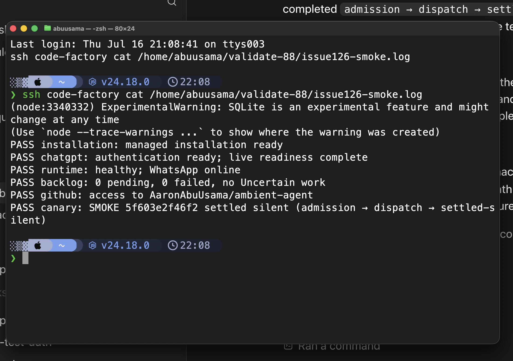
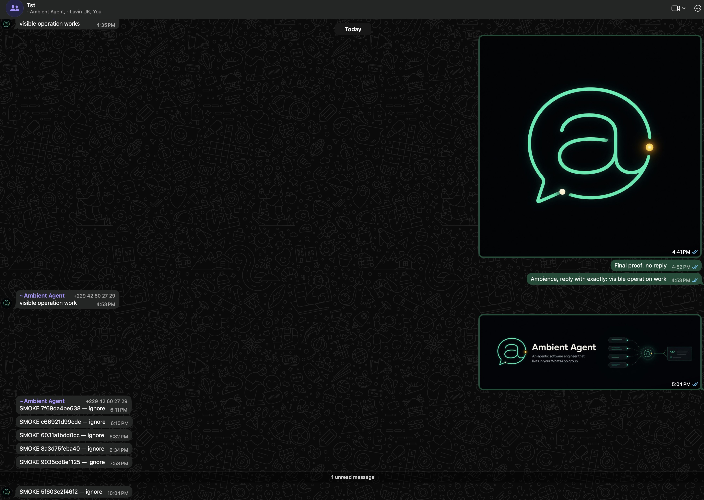
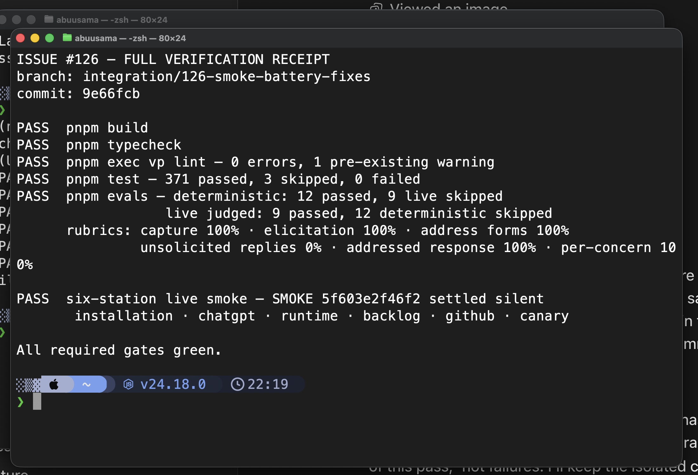

# Smoke battery review — live proof

Date: 2026-07-16

Ticket: [#126](https://github.com/AaronAbuUsama/ambient-agent/issues/126)

This records the integration review of the smoke battery against the packed CLI, the real managed installation, the real paired WhatsApp account, and the authenticated eval battery.

## Rig

- Host: `code-factory` (user `abuusama`)
- Persistent runtime: tmux session `validate-88`, pane `1.1`
- Smoke transcript: tmux window `validate-88:smoke126`
- Tarball: `$HOME/validate-88/ambient-agent-0.2.2-issue126.tgz`
- Packed artifact SHA-256: `2861ea86f19fe78e26facada2a1c5197264b0557cc41a2d7d5d725fe902343b1`
- Runtime health endpoint: `http://127.0.0.1:42069/health`
- Canary group: the paired account's dedicated managed TST group

The default installation database had already advanced to the schema under review in #114. To avoid mutating or downgrading it, this proof ran against an isolated clone at `$HOME/validate-88/issue126-data` with the current `main` schema. Only the isolated clone was adapted; the default live database was untouched.

The packed runtime was started with:

```sh
npx --yes --package=file:$HOME/validate-88/ambient-agent-0.2.2-issue126.tgz \
  ambient-agent --data-dir $HOME/validate-88/issue126-data start
```

## Six-station smoke transcript

Command:

```sh
npx --yes --package=file:$HOME/validate-88/ambient-agent-0.2.2-issue126.tgz \
  ambient-agent --data-dir $HOME/validate-88/issue126-data smoke --timeout 60000
```

Real output:

```text
PASS installation: managed installation ready
PASS chatgpt: authentication ready; live readiness complete
PASS runtime: healthy; WhatsApp online
PASS backlog: 0 pending, 0 failed, no Uncertain work
PASS github: access to AaronAbuUsama/ambient-agent
PASS canary: SMOKE 5f603e2f46f2 settled silent (admission → dispatch → settled-silent)
```



The persistent runtime independently rendered the same nonce and lifecycle:

```text
10:04:35 PM  ← [Ambient Agent] SMOKE 5f603e2f46f2 — ignore
10:04:38 PM  ▶ [AGENT] Processing: 1 message
10:04:41 PM  ✓ [AGENT] Completed: 2.4s
10:04:41 PM  — settled silent
```

The WhatsApp client showed the exact canary as the final TST message, with no reply following it:



## Settled-canary replay result

The exact replay scenario required by #126 already exists on the current `main` base in `tests/intake/managed-chat-inbox.test.ts`: settle and archive the canary, reopen the Inbox with group participation enabled, and assert that no pending or unwindowed work is recreated. The focused test passed. Admission is idempotent, so no additional reopen guard was required.

## Automated verification

Final checks on the integration branch:

```text
PASS  pnpm build
PASS  pnpm typecheck
PASS  pnpm exec vp lint — 0 errors, 1 pre-existing warning
PASS  pnpm test — 371 passed, 3 skipped, 0 failed
PASS  pnpm evals — deterministic: 12 passed, 9 live skipped
                   live judged: 9 passed, 12 deterministic skipped
```

Authenticated live rubrics were all within their required bounds: issue capture 100%, elicitation 100%, address forms 100%, unsolicited replies 0%, addressed response 100%, and per-concern handling 100%.



## Proof boundary

- **Live-runtime proof:** the packed artifact passed all six stations; the exact nonce entered the real TST group; the normal admission, dispatch, and settlement path completed; and no Say followed the canary.
- **Automated proof:** the full suite, exact settled-canary replay, request-level smoke route, runtime lifecycle, malformed-receipt rejection, typecheck, lint, deterministic evals, and authenticated judged evals passed.
- **Isolation:** temporary eval credential copies and source/data directories were removed after capture. The default installation database was not mutated for this proof.
- **Not claimed:** Braintrust export was disabled because `BRAINTRUST_API_KEY` was unset; the local judged evals themselves ran and passed.
