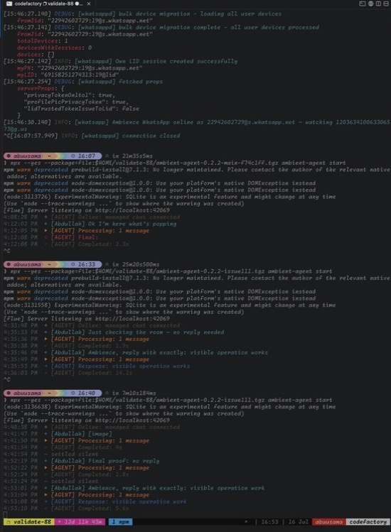
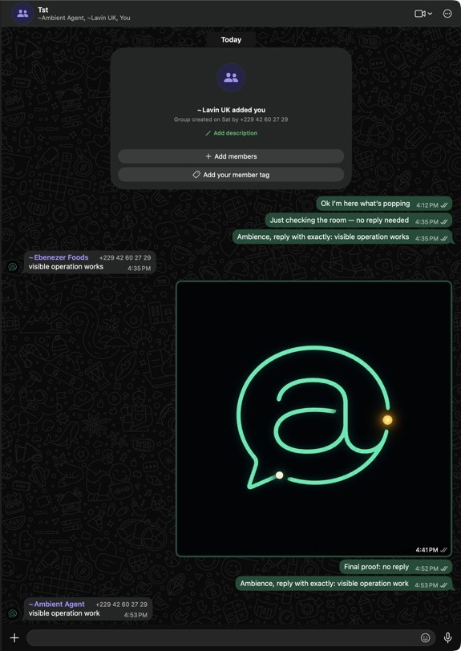

# Visible operation — live proof

Date: 2026-07-16

Ticket: [#111](https://github.com/AaronAbuUsama/ambient-agent/issues/111)

This checklist covers the human/live boundary that unit tests cannot establish: the packed CLI connected to the real managed WhatsApp group, the default console rendering semantic activity, and a real WhatsApp client seeing the Say-side typing beat.

## Rig

- Host: `code-factory` (user `abuusama`)
- Persistent terminal: tmux session `validate-88`, pane `1.1`
- Inspect it with `ssh code-factory`, then `tmux attach -t validate-88`
- Command under test:

  ```sh
  npx --yes --package=file:$HOME/validate-88/ambient-agent-0.2.2-issue111.tgz ambient-agent start
  ```

- `--debug` was not used.
- Packed artifact SHA-256: `1bce4fef54c900ca3a89a7bdbcc2b03f9cb516fff9cdadf145f329bd9412ce4c`

## Phase 1 — merged #108 baseline

The first live run repacked `origin/main` at `f74c1ff` because the tarball already on the rig predated PR #108. Its default-console transcript was:

```text
4:08:28 PM  ◆ [AGENT] Online: managed chat connected
4:12:02 PM  ← [Abdullah] Ok I’m here what’s popping
4:12:05 PM  ▶ [AGENT] Processing: 1 message
4:12:08 PM  ◇ [AGENT] Final:
4:12:08 PM  ✓ [AGENT] Completed: 2.3s
```

What worked:

- The real inbound text rendered as an info-level chat line on the default console.
- Window processing and completion were visible.
- whatsappd protocol/debug noise did not enter the default operator feed.

What was missing:

- A silent window had no terminal settlement line.
- The empty private final rendered as a blank `Final:` line.
- The activity reporter was not exposed as the ratified `AmbienceObserver` seam.
- This silent baseline did not exercise a Say or establish perceptible typing.

## Phase 2 — final live transcript

The final pack ran in the same tmux pane. Two messages were posted through the real TST group: one deliberately silent and one addressed. The default console showed:

```text
4:52:19 PM  ← [Abdullah] Final proof: no reply
4:52:22 PM  ▶ [AGENT] Processing: 1 message
4:52:24 PM  ✓ [AGENT] Completed: 1.8s
4:52:24 PM  — settled silent
4:53:01 PM  ← [Abdullah] Ambience, reply with exactly: visible operation work
4:53:04 PM  ▶ [AGENT] Processing: 1 message
4:53:08 PM  → [AGENT] Response: visible operation work
4:53:10 PM  ✓ [AGENT] Completed: 5.6s
```



The WhatsApp client showed both real inbound prompts and the delivered Say:



During the addressed window, WhatsApp's live accessibility state exposed `Maybe Ebenezer Foods is typing...` before the Say appeared. The host implementation starts typing only inside `say`, holds it for a 750 ms lead, performs the Say, then clears typing from `finally`; it never spans deliberation. The runtime test fixes the clock between typing-on and Say, asserts that delivery has not begun during the visible beat, and forces delivery bookkeeping to throw to prove cleanup is unconditional.

## Checklist

- [x] Packed CLI ran against the real managed group on `code-factory`.
- [x] Default console used; no `--debug` flag.
- [x] Inbound message text rendered as a chat line.
- [x] Addressed window rendered processing and the confirmed Say line.
- [x] Silent window rendered the dimmed `— settled silent` line.
- [x] WhatsApp exposed a real typing state before the Say landed.
- [x] Protocol/debug noise stayed out of the default operator feed.
- [x] Runtime remains attached to tmux session `validate-88` for inspection.

## Automated verification

Final branch checks:

```sh
pnpm build
pnpm exec vp lint
pnpm typecheck
pnpm test
FLUE_BASE_URL=http://127.0.0.1:3583 pnpm evals
git diff --check
```

The deterministic eval fixture was used for the non-live eval cases; provider-backed live evals remained intentionally gated. Build and TypeScript checks passed. The full suite passed with 339 tests, with 3 intentional skips; deterministic evals passed 8 tests, with 8 live-provider cases gated. Lint reported three pre-existing warnings outside the changed files and no errors.

## Proof boundary

- **Live-runtime proof:** packed CLI, real paired WhatsApp transport, real managed-group messages, default-console inbound/processing/Say/silent rendering, and client-visible typing before delivery.
- **Automated proof:** observer correlation and deduplication, normal and recovery settlement, failure rendering, dim operator styling, Say-only typing order, and the perceptible lead interval.
- **Not claimed:** terminal color cannot be represented in the pasted plaintext transcript; the screenshot records the actual dim rendering. Provider-backed nondeterministic evals were not enabled.
