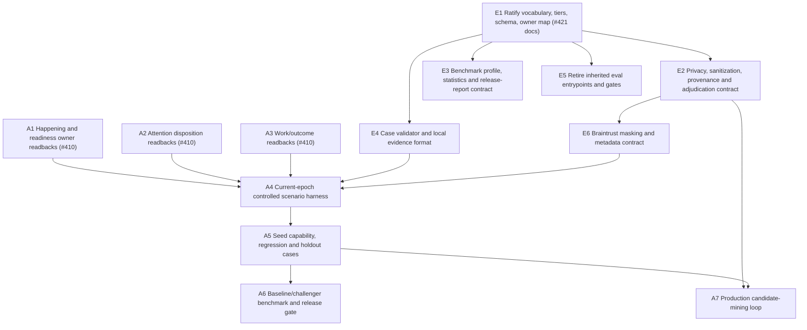

# #421 research — evaluation framework and model-benchmark methodology

## Finding

Ambient Agent should not repair or port its inherited eval suite. The durable foundation is
an **application-owned, architecture-epoch case contract**, executed with the already
installed Vitest/vitest-evals and public Flue seams, with Braintrust used for versioned
datasets, experiments, comparison, tracing, and review.

The shared root — the evaluation **nest** — is:

> The repository has no architecture-epoch, owner-attributed case contract that binds one
> source occurrence to its knowledge, accountability, execution, and user-visible outcomes.
> Inherited prompts, rubrics, thresholds, and experiment rows are symptoms of that missing
> contract, not a foundation to preserve.

This follows the accepted architecture: receipt alone does not prove knowledge or
responsibility, a mechanically settled Brain Batch does not prove per-Happening
accountability, and the Coworker is the composition rather than one agent
([canon §2](../SYSTEM-ARCHITECTURE.md#L110),
[canon §13](../SYSTEM-ARCHITECTURE.md#L734)).
Map [#409](https://github.com/AaronAbuUsama/ambient-agent/issues/409) owns the retained
runtime's mechanical, integrated, live, readback, and observed proof ladder. Map
[#410](https://github.com/AaronAbuUsama/ambient-agent/issues/410) owns implementation of the
accountable information path. Evaluation tiers are orthogonal to those proof tiers, and this
research does not move either implementation frontier.

Durable methodology:
[`docs/EVALUATION-METHODOLOGY.md`](../EVALUATION-METHODOLOGY.md).
Primary-source and licensing notes:
[`docs/reference/evaluation/INDEX.md`](../reference/evaluation/INDEX.md).

Committed artifact links:

- [Research finding](https://github.com/AaronAbuUsama/ambient-agent/blob/codex/issue-421-evaluation-methodology/docs/research/421-evaluation-framework-and-model-benchmark.md)
- [Evaluation methodology](https://github.com/AaronAbuUsama/ambient-agent/blob/codex/issue-421-evaluation-methodology/docs/EVALUATION-METHODOLOGY.md)
- [Annotated primary-source notes](https://github.com/AaronAbuUsama/ambient-agent/blob/codex/issue-421-evaluation-methodology/docs/reference/evaluation/INDEX.md)

## Read from sources versus inferred

**Read from current code and first-party sources:**

- The canon's accountable path and current built/designed boundary.
- The inherited harness, rubrics, thresholds, runner, and Braintrust reporter.
- Installed dependency versions and SDK declarations.
- Flue's public evaluation, workflow, SDK, observation, and tooling boundaries.
- Braintrust's dataset versioning, trials, experiment comparison, scoring, tracing, masking,
  and provider-comparison capabilities.
- Anthropic's case/trial/grader/outcome vocabulary, capability/regression distinction,
  outcome-first grading, human calibration, production feedback loop, and statistical advice.

**Inferred for Ambient Agent:**

- The case contract, five-tier evaluation ladder, owner/evidence map, architecture-epoch rule,
  privacy admission, candidate lifecycle, release gates, and evaluation expedition below.
- The recommendation to use Braintrust as an analysis/registry surface rather than the
  authority for release or application outcome truth.

## Current-stack inventory

### Architecture and data owners

| Layer                        | Current evidence                                                                                                                                                                       | Evaluation consequence                                                                                                                                                   |
| ---------------------------- | -------------------------------------------------------------------------------------------------------------------------------------------------------------------------------------- | ------------------------------------------------------------------------------------------------------------------------------------------------------------------------ |
| Source Archives / Happenings | Conversation Archive and durable GitHub receipt foundations exist; a common Happening/readiness seam is designed, not built ([canon §13](../SYSTEM-ARCHITECTURE.md#L740))              | Existing provider archives remain payload truth. Evaluate receipt and identity at their owner; wait for the common seam before claiming cross-source Happening coverage. |
| Graph / Scribe               | Append-only Attestations, Evidence Sets, deterministic projection, and Scribe attempts exist; routine Scribe deltas still wake the Brain ([canon §13](../SYSTEM-ARCHITECTURE.md#L743)) | Grade provenance and projection structurally; grade semantic support separately. Do not make a Scribe score stand in for Attention.                                      |
| Attention                    | Not built; current Batch settlement can be satisfied without per-input disposition ([canon §13](../SYSTEM-ARCHITECTURE.md#L746))                                                       | No current case can prove the target accountable path end to end. Schema/method work can proceed; Attention outcome cases depend on #410 implementation.                 |
| Brain                        | Durable global actor and crash-stable Batch exist; it still claims mixed raw/delta inputs ([canon §13](../SYSTEM-ARCHITECTURE.md#L749))                                                | Evaluate current recovery primitives honestly, but do not benchmark the designed knowledge-ready judgement path until implemented.                                       |
| Work / Effects               | Typed Effects and Specialist execution ledgers exist; generic Work responsibility is missing ([canon §13](../SYSTEM-ARCHITECTURE.md#L752))                                             | Evaluate effect/execution integrity at current owners. Whole Work lifecycle cases wait for the thin Work ledger.                                                         |
| Surface / Speaker            | Directive-only Saying and durable delivered/failed/Uncertain outcomes exist; Speaker is the local mouth ([canon §13](../SYSTEM-ARCHITECTURE.md#L748))                                  | Deterministically grade authorization and delivery. Use semantic grading only for conversational expression and escalation judgement.                                    |

The durable vocabulary already distinguishes Surface Delivery, Intent, Brain Batch/Effect,
Directive Outcome, Source Archive, Happening, Attention, and Work
([`CONTEXT.md`](../../CONTEXT.md#L52)). Evaluation must preserve those authorities.

### Existing evaluation code is archaeology

The inherited harness creates an artificial `eval-*.g.us` instance, seeds old fixture
routes, prompts a named agent or submits a Speaker Window, then collects faux WhatsApp/GitHub
events and conversation history
([`harness.ts`](../../packages/test-support/src/evals/harness.ts#L278)).

Its model judge reads removed capability skill bundles and applies hard-coded participation
axes and thresholds
([`rubric-judges.ts`](../../packages/agents/evals/rubric-judges.ts#L1)).
Its Braintrust reporter mutates one issue-113-era experiment and gates on aggregate
thresholds
([`braintrust-reporter.ts`](../../packages/test-support/src/evals/braintrust-reporter.ts#L1)).
The Vitest config still discovers those old capability eval paths
([`vitest.evals.config.ts`](../../vitest.evals.config.ts#L1)).

These contracts assume the pre-reset agent topology and cannot be treated as current
behavioral truth. Potentially reusable plumbing is limited to generic ideas: fresh instance
per trial, normalized events/usage/timing, and public SDK-driven execution. Reuse must happen
behind a newly ratified case contract; no old case, dataset, scorer, rubric, threshold, runner
mode, or Braintrust experiment is grandfathered.

### Installed tools

| Tool                     |      Installed | Useful boundary                                                                                                             | Gap                                                                                            |
| ------------------------ | -------------: | --------------------------------------------------------------------------------------------------------------------------- | ---------------------------------------------------------------------------------------------- |
| Flue runtime / SDK / CLI | `1.0.0-beta.9` | Public in-process and HTTP agent/workflow execution, durable run/conversation reads, runtime events and Braintrust observer | Not an eval framework; live observer is not durable outcome truth or replay                    |
| Vitest                   |       `4.1.10` | Deterministic tests and one familiar runner                                                                                 | No domain case contract                                                                        |
| vitest-evals             |       `0.14.0` | Custom harness, normalized trial, judges, tool-call views, JSON report                                                      | Current docs describe 0.15.0; harness cannot invent application fixtures/readbacks             |
| Braintrust               |       `3.17.0` | Versioned datasets, experiments, trials, scorers/classifiers, comparisons, online scoring, traces, masking                  | Existing integration configures tracing only; masking and current-epoch eval policy are absent |

Versions are pinned in [`package.json`](../../package.json#L55). The current production bridge
configures Braintrust tracing from Flue events but does not install a masking function
([`braintrust.ts`](../../packages/engine/src/braintrust.ts#L1)).
Runtime model selection already supports provider choice and role-specific model ids while
preserving each role's thinking level
([`model-configuration.ts`](../../apps/cli/src/model-configuration.ts#L58));
the benchmark protocol should record and compare those profiles, not replace them.

## Primary-source conclusions

The annotated source and license record is
[`docs/reference/evaluation/INDEX.md`](../reference/evaluation/INDEX.md). The decisive
boundaries are:

1. **Flue:** drive a full loop through public application surfaces; assert observable effects,
   prefer deterministic checks, and treat Braintrust tracing as independent of eval cases and
   gates.
2. **Braintrust:** pin dataset versions/snapshots, retain repeated trials, compare matching
   cases against a baseline, separate scorers from classifiers, use online scoring for
   sampled production triage, and install/test masking before export.
3. **Anthropic:** define case/trial/grader/transcript/outcome explicitly; combine deterministic,
   model, and human grading; separate capability from regression; prove cases are solvable;
   grade outcomes; calibrate judges; feed production failures back through human review.
4. **Statistics:** repeated trials of the same case are correlated. Report case-level paired
   differences and uncertainty rather than treating every trial as independent.
5. **No new dependency:** the installed stack covers the executable foundation. Adding another
   framework now would create a second runner or registry before the case contract exists.

## Gap inventory

| Gap                                              | Consequence                                                  | Required response                                                                              |
| ------------------------------------------------ | ------------------------------------------------------------ | ---------------------------------------------------------------------------------------------- |
| No case schema or architecture epoch             | Old assumptions can silently become current gates            | Ratify one repository case contract and validator                                              |
| No owner-to-evidence policy                      | Transcript scores can impersonate application truth          | Bind each expectation/scorer to its architecture owner and durable readback                    |
| No candidate/sanitization/adjudication lifecycle | Production traces risk becoming raw or mislabeled datasets   | Keep raw evidence local; sanitize, adjudicate, and version before dataset admission            |
| No judge calibration policy                      | Subjective thresholds can drift with judge model/prompt      | Version one-dimension judges and measure agreement against human adjudication                  |
| No benchmark profile or paired protocol          | Model/provider comparisons are irreproducible                | Pin dataset, environment, code, role profiles, judge, trials, cost/latency units, and baseline |
| No holdout or retirement rules                   | Tuning leakage and stale cases make green scores meaningless | Restrict holdout access; preserve retirement tombstones across epochs                          |
| Tracing lacks explicit masking                   | Content-bearing events may leave the application boundary    | Design and test fail-closed masking before evaluation or wider production export               |
| Target Attention/Work path not implemented       | Current E2/E3 suite cannot prove target accountability       | Build schema/policy independently; bind executable path cases to #410 nodes when present       |

## Options

### A. Repair the inherited suite

```diff
- old cases fail after architecture reset
+ patch fixture routes, agents, rubrics, thresholds and reporter until green
```

This is rejected. It would ratify the wrong unit—an isolated capability-agent prompt—and
launder pre-reset behavior into the new architecture.

### B. Make Braintrust the primary eval platform

```diff
+ upload cases and traces first
+ define datasets, judges and release thresholds in Braintrust
```

This provides a fast experiment UI but places architecture epochs, privacy admission, and
application outcome truth behind a vendor surface. Repository review and local reproducibility
would be secondary.

### C. Application-owned cases; installed execution and analysis stack

```diff
+ repository case schema + architecture epoch + owner readbacks
+ Vitest/vitest-evals custom harness over public Flue/application seams
+ Braintrust versioned dataset/experiment mirror and comparison
+ human adjudication, sanitization, holdout and retirement policy
```

This keeps the durable claim and gates local while using each installed tool for the boundary
it actually owns.

### D. Adopt another framework

```diff
+ second runner, case format, reporting/registry dependency
```

No demonstrated gap warrants this. Reconsider only if the executable foundation exposes a
specific requirement that Vitest/vitest-evals, Flue, Braintrust, and small application code
cannot satisfy.

## Grade and recommendation

Scores are 1 (poor) to 5 (strong); a higher blast-radius score means a more contained change.

| Option                                              | Floor-first | Reversibility | Blast radius | Correctness / integrity | Parallelizability |   Fit |
| --------------------------------------------------- | ----------: | ------------: | -----------: | ----------------------: | ----------------: | ----: |
| A. Repair inherited suite                           |           1 |             2 |            1 |                       1 |                 2 |     1 |
| B. Braintrust-first authority                       |           3 |             3 |            3 |                       2 |                 3 |     3 |
| **C. Application-owned contract + installed stack** |       **5** |         **5** |        **4** |                   **5** |             **5** | **5** |
| D. New framework                                    |           1 |             3 |            2 |                       2 |                 2 |     1 |

**Recommendation: C.** It is the smallest option that can evaluate the real architecture,
keeps sensitive evidence and release authority under application control, and lets independent
work proceed before #409/#410 complete.

## Evaluation expedition DAG (proposal only)

This is a separate expedition. It does not belong inside the #409 retained-runtime repair or
the #410 information-to-accountability implementation.



### Independent of #409 and #410

- **E1:** this methodology and research finding.
- **E2:** privacy, sanitization, provenance, adjudication, holdout, and retirement policy.
- **E3:** configurable model/provider/effort profile schema, paired-trial statistics, report,
  baseline/challenger rules, and release gates.
- **E4:** a machine-readable case schema validator and local evidence format that do not invoke
  the target runtime.
- **E5:** removal/quarantine of obsolete eval discovery, scripts, cases, rubrics, thresholds,
  and the old Braintrust reporter in a separate reviewable PR.
- **E6:** a fail-closed Braintrust masking test and stable correlation metadata contract. Any
  production tracing change still needs its own security review.

### Dependent on #410 implementation (and #409 where it blocks that implementation)

- Owner readbacks for common Happenings, Attention dispositions, generic Work, and outcome
  re-admission.
- The first controlled accountable-path harness and current-epoch cases.
- Baseline numbers, regression gates, holdout results, and production candidate automation
  that claim the target architecture.

The expedition should begin with E2/E3/E4 in parallel, not an eval migration. The first
executable target should be three sanitized cases—positive, negative, recovery—for one
implemented accountable slice. Growth proceeds owner by owner.

## Decisions remaining for the planning orchestrator

1. Create the separate evaluation expedition and sequence E2/E3/E4 before executable runtime
   cases.
2. Choose the architecture decision or canon commit that names epoch 1 after #410's target
   contracts land.
3. Assign the privacy/adjudication owner and restricted holdout access policy.
4. Decide which implemented accountable slice is the first three-case executable foundation.
5. Schedule obsolete-suite retirement as deletion, not migration.

Issue #421 should remain open for the planning orchestrator to decide whether this research
settles its node.
